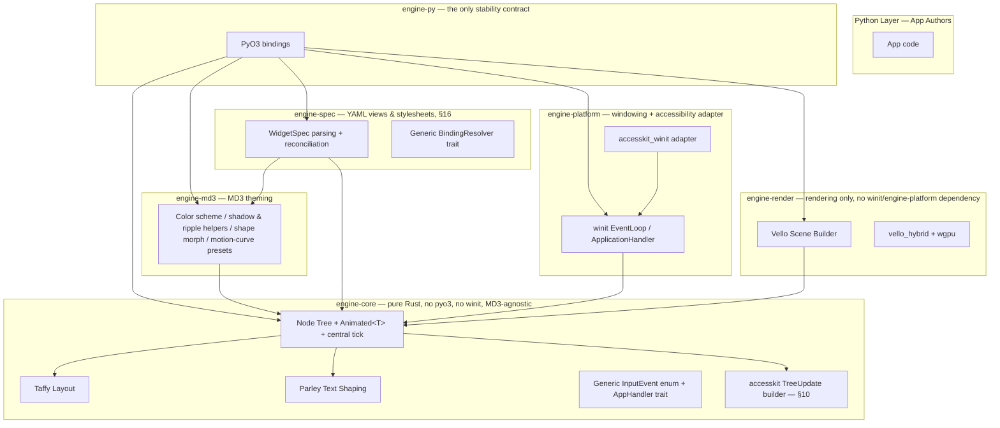
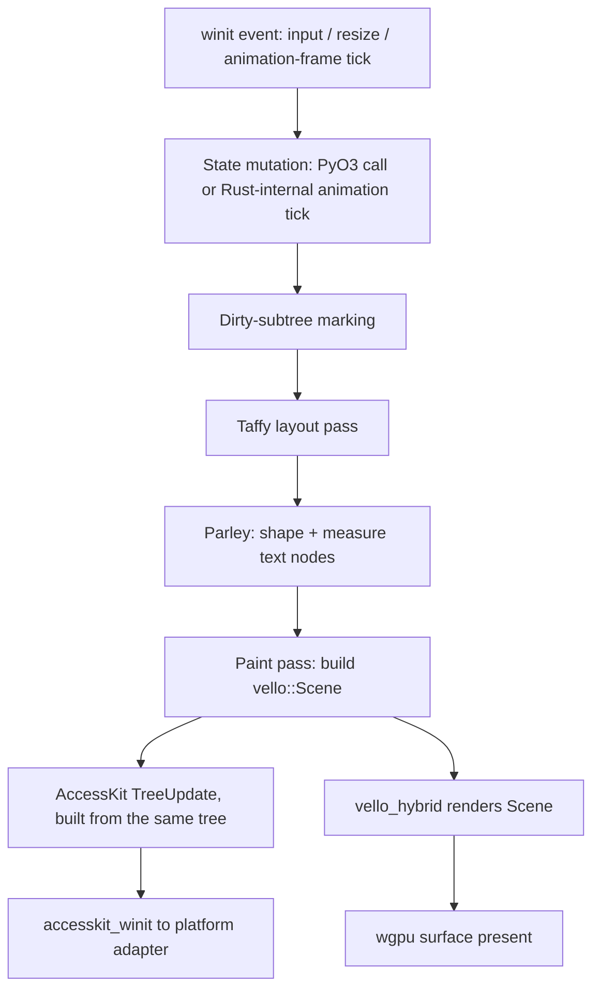

# GUI Framework Architecture

**Python-facing declarative/imperative GUI framework, Rust-native rendering backend.**

Status: living design reference, actively implemented. 25 milestones built against this document as of `v0.2.0` (see [`BUILD_TRACKER.md`](BUILD_TRACKER.md) for the complete phase-by-phase history) — update it as decisions change, don't let it drift from the actual code.

---

## 1. Vision & Scope

- Application authors write **Python**. They never touch Rust, WGPU, or Vello directly.
- The rendering, layout, animation, and accessibility engine is **Rust-native**, exposed through a thin, deliberately stable PyO3 boundary.
- Target: desktop apps (Windows/macOS/Linux) with a full **Material Design 3** visual language — dynamic color, elevation shadows, state layers/ripple, shape morphing, and MD3 motion (tweening/easing).
- **Explicitly out of scope: mobile (iOS/Android), web (WASM/browser), and bindings for any language other than Python.** `engine-py` (PyO3) is the only planned binding layer — there is no general C ABI crate (unlike TRE's `tre-ffi`, which existed for zero actual consumers) and none is planned. This is a deliberate scope narrowing versus TRE: every hour spent on binding-layer work goes toward the one binding that ships, not toward a hypothetical second consumer.
- Explicitly **not** built on Masonry. Same underlying libraries Masonry itself uses (`vello_hybrid`, `taffy`, `parley`, `accesskit`), but a purpose-built retained tree designed around a uniform, centrally-ticked animation system — see [ADR-001](#adr-001-hand-rolled-vs-masonry) for the reasoning.

### Locked Decisions

A running log of resolved architectural questions, kept in one canonical place rather than scattered across sections — a direct application of `archive/LESSONS_LEARNED.md` §6 ("separate the audit trail from the live worklist"). Add a row here each time a genuinely open question gets settled, in whichever section we're discussing.

| Decision | Choice | Why |
|---|---|---|
| Scope | Desktop only (Windows/macOS/Linux); no mobile, no web; Python is the only binding language | Deliberate narrowing vs. TRE — see the scope bullet above |
| Python packaging | Per-version wheels, no `abi3` | Full PyO3 API access; matches TRE's own precedent. Accepted trade-off: a larger OS × Python-version CI/packaging matrix than `abi3` would need |
| GPU backend selection | Pinned per OS, not `wgpu`'s automatic detection — `Backends::VULKAN` on Linux, `Backends::DX12` on Windows, `Backends::METAL` on macOS | Deterministic: the backend exercised in CI is the exact one every user gets on that OS, so a driver/validation issue found once stays found and fixed |
| Platform rollout order | Primary OS first (**Linux**, confirmed), Windows/macOS CI added later | Faster early iteration. Accepted trade-off is the same pattern that left TRE's Python bindings uncovered for three-quarters of that project — mitigated below with a concrete trigger instead of an open-ended "later" |
| Node data model | Common `PaintProperties` core + per-`NodeKind` payload structs, unified via a shared `AnimatedNodeState` trait (§5) | Avoids one ever-growing "god struct" as MD3's real component catalog (dozens of components, many with unique animatable state) gets built out |
| App entry point | Single blocking `app.run()`; no non-blocking/embeddable mode planned (§2) | Matches Design Principle 1 exactly and every major desktop GUI toolkit (Qt, GTK, Tkinter) |
| Linux display protocol | Both Wayland and X11 (`winit` `x11`+`wayland`+`wayland-dlopen` features), Wayland primary (§3) | Broadest real-world Linux desktop compatibility; matches TRE's own precedent |
| MD3 icon pipeline | MD3's own icon set embedded as `kurbo::BezPath` data at build time; `usvg`+`vello_svg` reserved for user-supplied custom SVG only (§3) | Sidesteps `vello_svg`'s documented gaps for the framework's own default, most-used icon set |
| System tray / native menus | Deferred past v1 — `tray-icon`/`muda` not included (§3) | Both require GTK on Linux with no portal alternative; v1 carries zero GTK dependency, avoiding the exact dependency class behind TRE's wheel-vendoring segfault |
| `engine-core` / `engine-md3` coupling | Keep `engine-core` MD3-agnostic — it defines generic types (`MotionCurve`, a generic interpolation trait); `engine-md3` depends on it, not the reverse (§4) | Provably one-directional dependency graph, `engine-core` stays testable in total isolation, even though no second design language is currently planned |
| Windowing crate | A dedicated `engine-platform` crate owns `winit`/`accesskit_winit`; `engine-render` depends only on `raw-window-handle` (§4) | Matches TRE's own `tre-platform` precedent; keeps `engine-render` renderable/testable with zero windowing dependency, and keeps accessibility's platform-adapter wiring out of the rendering crate |
| Animation completion callbacks | Queue-drain: `tick()` pushes finished `CompletionHandle`s to a plain `Vec`; `engine-py` drains it once per frame and resolves against its own `PyObject` map (§5) | Keeps `tick()` a pure, reentrancy-free state-mutation pass; `ActiveAnimation<T>` stays a plain data struct with no `Send`-closure coupling to one downstream consumer |
| `NodeKind` scope | Closed enum, one variant per MD3 component (§5) | Multi-design-language support is out of scope (§1) — a generic/extensible mechanism would be the same never-exercised abstraction LESSONS_LEARNED.md §1 warns against (TRE's stub RHI backends) |
| `NodeId` identity | Generational index (slot index + generation), not a plain integer (§5) | A stale `PyNode` handle held past node removal (§8) fails a checked comparison instead of silently addressing the wrong node — the generational-index answer to TRE's finding #259 (a dangling raw handle across a GC-controlled boundary) |
| Layout dirty-scoping | Rely on Taffy's own incremental cache; no hand-rolled `dirty_layout`/`dirty_paint` flag system. Named exception: `Splitter`/`DockZone` explicitly `mark_dirty()` (§6, §11.5) | `PaintProperties`/most `NodeKind` payloads share no fields with `taffy::Style`, so a paint-only animation structurally can't mark Taffy dirty — automatic, not manually classified, for every component except the two that are genuinely layout-affecting by nature |
| Frame budget | 16.6ms (60Hz) target, 8.3ms (120Hz) stretch goal, enforced by a CI benchmark added no later than build-order step 3 (§6, §14) | A stated-but-unenforced number is exactly TRE's MSRV mistake (LESSONS_LEARNED.md §5) restated in a new form |
| Ripple concurrency | Bounded list of concurrent ripples per node (`interaction: Option<InteractionState>`, §5, §7.3), not one scalar pair | Matches MD3's real overlapping-ripple behavior under rapid taps; reuses §5's completion-queue mechanism per-ripple |
| Dynamic color source | Third-party MCU-port crate, gated on passing Material Color Utilities' own published reference test vectors before pinning (§7.1) | HCT/tonal-palette/contrast math is a large, easy-to-get-subtly-wrong subsystem — reimplementing it is bigger and riskier than it looks, unlike shape morphing's one missing step |
| Live theme switching | Supported at runtime via `winit`'s `ThemeChanged` event, forwarded through the existing `AppHandler`/`InputEvent` inversion (§4, §7.1) | A rare, discrete, whole-tree-repaint event — matches modern desktop UX expectations at negligible design cost given the event-dispatch path already exists |
| Container transform | In scope for v1 (§7.6) — implemented as `engine-md3` choreographing existing `ActiveAnimation`s across two nodes; no navigation/router subsystem added | User's explicit choice, opposite of the recommended default (defer, no nav model exists); resolved by keeping the framework itself navigation-agnostic — it exposes the transition choreography, not "what screens exist" |
| `animate()` dispatch | Single generic, string-keyed method — no per-property typed methods (§8) | Typed methods would push toward one Python class per `NodeKind` variant to cover component-specific properties, multiplying the FFI surface by MD3's component count — the same growth cost §7 already chose to pay once, not again |
| Callback cyclic-GC support | Implemented now via one `PyWindow` (`#[pyclass(gc)]`) per OS window, each owning that window's callback maps, not deferred (§8, §11.1) | This project's own target — long-running apps with dynamically created/destroyed widgets — is exactly the profile where an uncollected reference cycle accumulates during normal operation |
| `Tree` ownership | `Rc<RefCell<Tree>>` + `#[pyclass(unsendable)]`, not `Arc<Mutex<>>` (§9) | Matches actual v1 scope (single main thread only); asyncio bridging is optional/future and its threading shape is undecided — revisit this first if that work is ever built |
| Callback exception policy | Caught, logged via `tracing`, non-fatal — the render loop always survives a bad callback (§9) | Matches every mainstream main-thread-owned GUI toolkit (Tkinter, Qt, GTK); a broken handler shouldn't take down a shipped app for its end user |
| `accesskit::TreeUpdate` builder | Lives in `engine-core` (new direct dependency on plain `accesskit`), not `engine-render` (§4, §10) | `accesskit` is small and OS-agnostic like `taffy`/`parley`; keeps a11y-semantic interpretation with the crate that already owns `AccessNodeData`'s meaning |
| Keyboard focus model | Minimal model specified now in `engine-core` (Tab-order focus + `Action::Default`/`Action::Focus`); component-specific arrow-key nav deferred per-component (§10) | Keyboard operability is WCAG 2.1's baseline requirement, not a nice-to-have — an explicit, written scope decision rather than a silent gap (LESSONS_LEARNED §7) |
| Multiple windows | One `Tree` per OS window, not a shared multi-root tree (§11.1) | Zero changes needed to the already-locked Node/`NodeId`/`Tree` model; cross-window node transfer is an accepted gap, not a blocker |
| App shell / navigation | Optional `AppShell` composition (named regions + one content region) within a single `Tree`; content swap, not a multi-screen router (§11.2) | Matches the single-page-app model requested; reverses §7.6's "no navigation model" only as far as this one persistent-shell case, not a general router |
| Menus, popups, dialogs | Custom-rendered overlay layer — one mechanism for menu bars, dropdowns, context menus, tooltips, and dialogs (§11.3) | Reinforces §3's zero-GTK decision rather than reopening it; reuses container-transform's existing "insert above root" trick (§7.6) |
| Docking | In scope for v1 — a fixed 5-zone (`Left`/`Right`/`Top`/`Bottom`/`Center`) model, not arbitrary nested splits (§11.4) | User's explicit choice, opposite the recommended default (defer); scoped to the fixed-zone case specifically to keep a large, MD3-precedent-free feature shippable |
| Virtualization | Framework-level `NodeKind::VirtualList`, not an app-level responsibility (§11.7) | Matches §1's own goal (Python needs everything without extra Rust work) for one of the most common, non-optional desktop patterns |
| MVVM data binding | A pure-Python `bind()` helper built on the existing `animate()` FFI call, not a new Rust binding subsystem (§8) | Smaller than it looks — reuses an already-locked mutation path; GC-safe for free since the binding closure never leaves Python's own object graph |
| Declarative authoring | Add both YAML view files and a YAML stylesheet cascade, via a new `engine-spec` crate — not stylesheets alone, and not adopted wholesale from `pyCopper` (§16) | User's explicit request; design borrowed from a mature sibling project's already-proven precedence/reconciliation/safe-expression choices, reimplemented against `engine-core`'s own types rather than pulled in as a dependency |
| Reconciliation identity | A view file's `WidgetSpec.id` (author-assigned, stable) is a second identifier alongside `NodeId`, used only for hot-reload diffing (§16.1, §16.4) | `NodeId`'s generational index (§5) is a runtime handle with no meaning across a reload — conflating the two would break reconciliation the first time a slot got recycled |
| ViewModel/View wiring | The `ViewModel` holds the `View` reference and drives wiring (`View._attach(viewmodel)`); the `View` itself never knows who handles its events or supplies its bound values (§16.2) | User's explicit design: the View stays passive and reusable: handlers/bindings are just names until a ViewModel resolves them, matching the dependency-inversion shape already used for `AppHandler` (§4) |
| Reactive binding scope | A bound expression re-evaluates only on the `Signal`s it actually read last time (dependency tracking via a recording evaluation), not on every `Signal` the `ViewModel` exposes (§16.2) | Matches pyCopper's own proven "invalidates exactly the affected subtree" reactivity model rather than a coarser whole-view refresh |
| Attach validation | `_attach()` resolves and smoke-checks every handler/binding eagerly, failing at startup on a mismatch — never discovered lazily on first use (§16.2) | Matches `WidgetSpec`'s `deny_unknown_fields` posture and LESSONS_LEARNED §5's point about unenforced claims becoming fiction |
| Attach scope & cardinality | `_attach` targets any node (not only a `View`'s root), and one `ViewModel` instance may attach to nodes across multiple `View`s (§16.2) | Needed for §11.2's content-swap and §11.4's per-panel docking to each own a small `ViewModel`; free for the multi-view case since a `Signal`'s subscriber list was never view-scoped |
| View composition | An `include:` directive splices one view file into another at load time, under the same validation/confinement/cycle-detection guards as any other `WidgetSpec` (§16.6) | User's explicit ask, matching pyCopper's own proven `spec/include.py` pattern — keeps real app view files small |
| Two-way bindings | Sugar over an existing one-way binding plus an auto-generated handler on the widget's natural edit event; explicit YAML opt-in, plain `Signal` references only (§16.7) | Reuses both existing mechanisms rather than adding a third; reversibility rules out binding a computed expression two-way |
| Interaction-state ownership | Mechanical states (hover, focus, press) are detected and animated entirely in `engine-core`/`engine-md3`, zero app involvement required; meaning-dependent states (selected, checked, expanded) are ViewModel-owned via the ordinary binding/handler path (§2 Principle 6, §7.3) | The engine can determine a geometric fact on its own; it can never determine what an app's data means |
| Accessibility state derivation | Well-known `NodeKind`-payload fields (`checked`, `selected`, ...) derive their `AccessStates` flag automatically (§7.3, §10) | One property write keeps both the visual and the accessibility tree correct — nothing to remember to update twice |

**Secondary-OS CI trigger (proposed, adjust as needed):** add minimal build + smoke-test CI for Windows and macOS no later than build-order step 7 (§14, wiring `accesskit`) — the first point where real platform-specific behavior (UIA vs. NSAccessibility vs. AT-SPI) becomes load-bearing, and a natural forcing function to confirm the deferred OSes still build before investing further past it.

---

## 2. Design Principles

1. **Rust owns every frame. Python owns intent.** Python never runs during layout, paint, or animation interpolation. It triggers state changes and registers callbacks; Rust computes and renders. Concretely: the framework's Python entry point is a single blocking call (`app.run()`) that hands control to `winit`'s event loop and does not return until the app exits — the only Python code that runs after that point is inside a registered callback. No non-blocking/embeddable mode is planned (§1 Locked Decisions).
2. **One node type, uniformly animatable.** No per-widget-type animation boilerplate. Every animatable property anywhere in the tree — universal (`PaintProperties`, common to every node) or component-specific (a Slider's thumb position, a Checkbox's check-progress) — is the same `Animated<T>` primitive, ticked by one central system. This is a *mechanism* guarantee, not a single-struct guarantee: component-specific state lives in per-`NodeKind` payloads (§5), not bolted onto one ever-growing shared struct (§1 Locked Decisions).
3. **The PyO3 boundary is the only stability contract.** Internal crates (`engine-core`, `engine-render`, `engine-md3`) can churn freely. `engine-py`'s public surface is what you version and document for framework users.
4. **No dependency leaks across the boundary.** Vello, kurbo, peniko, taffy, accesskit types never appear in Python-facing signatures. Python sees Python types.
5. **De-risk the unknowns before building on them.** Vello's shadow/blur support and shape morphing have no prior art in this exact combination — spike them standalone before writing MD3 components against them.
6. **Rust detects and animates; the app decides what things mean.** An interaction state whose *fact* is purely geometric or positional — hover, focus, press — is detected and rendered entirely in `engine-core`/`engine-md3` (§7.3, §10), with zero app-author involvement required for the default MD3 visual, because the engine can determine it with no knowledge of what the app's data means. A state whose fact depends on that meaning — selected, checked, expanded — is ViewModel-owned, set through the same binding/handler path as any other property (§16.2): the engine never guesses at app semantics, it only ever renders whatever state it's told, through animation machinery it already owns either way.

---

## 3. Technology Stack

| Layer | Crate | Role |
|---|---|---|
| Windowing / input / IME | `winit` (`x11` + `wayland` + `wayland-dlopen` features) | Event loop (owns the main thread), window/surface handles — both Linux display protocols supported, Wayland primary (§1 Locked Decisions) |
| GPU | `wgpu` | Device/surface management |
| 2D scene + rasterization | `vello_hybrid` | CPU preprocess, GPU raster of paths/gradients/images/text/shadows |
| 2D geometry | `kurbo` | `BezPath`, `Affine`, `Point`, `Rect` — Vello's native geometry vocabulary |
| Brush / color / blend | `peniko` | `Color`, `Brush`, `BlendMode`, `Fill` |
| Text shaping/layout | `parley` | Shaping, line-breaking, BiDi → glyph runs into a `Scene` |
| Layout | `taffy` | Flexbox/Grid; leaf sizing for text comes from Parley |
| Accessibility | `accesskit` + `accesskit_winit` | Cross-platform a11y tree (UIA / NSAccessibility / AT-SPI) |
| MD3 icon set | embedded `kurbo::BezPath` data, generated at build time | Material Symbols pre-converted from source SVG once, at build time (a small internal tool, itself likely using `usvg` — just never at runtime); sidesteps `vello_svg`'s gaps entirely for the framework's own default icons (§1 Locked Decisions) |
| Custom/user SVG import | `usvg` + `vello_svg` | SVG → `Scene`, for user-supplied assets only, never MD3's own icon set (gaps: text, clipping, masking, filters, patterns — verify per-asset; now scoped to this optional path, not the default experience) |
| Raster assets | `image` | PNG/JPEG/etc. decode |
| MD3 dynamic color | `material-colors` (or equivalent MCU port — compare current maintenance state before pinning) | HCT color space, tonal palettes, scheme generation from a seed color |
| Clipboard | `arboard` | No GTK dependency on Linux |
| File dialogs | `rfd` (`xdg-portal` feature, not the GTK backend) | Matches TRE's own precedent — avoids GTK on Linux entirely |
| Python bindings | `pyo3` | Rust ⇄ Python FFI |
| Build/packaging | `maturin` | Builds the extension module as an installable wheel |
| Async bridge (optional) | `pyo3-async-runtimes` | Only if the Python framework needs asyncio-native app code; keep conceptually separate from the winit/render loop |
| Errors | `thiserror` | Typed errors at crate boundaries |
| Logging | `tracing` | Structured logs, correlate with frame timing |

**Deferred past v1:** system tray icons and native application menus (`tray-icon`, `muda`) — both need GTK on Linux with no portal-based alternative, and v1 deliberately carries zero GTK dependency (§1 Locked Decisions). Revisit once the packaging story is proven end-to-end.

> **Review note (from the TRE archive):** `vello_hybrid`, `parley`, `kurbo`, and `peniko` are the same young, co-evolving Linebender project, not four independently-versioned dependencies — a `vello_hybrid` API bump is likely to force compatible bumps in the others at the same time (or vice versa). Pin this family as one set with one shared compatibility note, not four separate per-crate pins, or you'll hit a period where no combination of individually-latest versions actually compiles together.
>
> **Review note (from the TRE archive):** `peniko::BlendMode` is likely a ready-made, portable answer to the exact problem TRE spent real effort solving via a Vulkan extension (`VK_KHR_dynamic_rendering_local_read`) and then debugging real validation-layer false positives around for multiple review cycles. Worth confirming early that it covers every MD3 blend mode you need (Multiply/Screen/Overlay/etc.) — if it does, this is a place where the new stack is strictly better than the old one, not just different.

---

## 4. System Architecture

Every edge below means the same thing — **compile-time "depends on."** Runtime call/data direction (which is not always the same as the dependency arrow — see the `AppHandler` note below) is spelled out in prose, not folded into the diagram; conflating the two was exactly what made the previous version of this diagram contradict §5's own code (it drew `engine-core → engine-md3` while `engine-core`'s `ActiveAnimation<T>` held an `engine-md3` type, an actual dependency in the opposite direction).



**Crate boundary rule:** `engine-core` has zero knowledge of Python, PyO3, `winit`, or `engine-md3` — it's testable and reusable standalone, and defines the generic types (`MotionCurve`, a generic interpolation trait, the `InputEvent` enum, the `AppHandler` trait) that other crates build on. It does directly depend on the plain `accesskit` crate (not `accesskit_winit`) — unlike `winit`/`pyo3`, `accesskit` itself is small, portable, OS-agnostic data types (`Node`, `TreeUpdate`, `Role`, `Action`), architecturally the same class of dependency as `taffy`/`parley`, both already here — so `Tree::build_access_update() -> accesskit::TreeUpdate` (§10) lives alongside the tree it's built from, not in a crate with no other reason to know accessibility semantics. `engine-py` is the only crate that imports `pyo3`. `engine-md3` depends on `engine-core` (§1 Locked Decisions: "keep `engine-core` MD3-agnostic") to supply *named presets* of those generic types (e.g. `engine_md3::motion::STANDARD: engine_core::MotionCurve`) — it never feeds data back into `engine-core`, so there's no cycle. `engine-render` depends on `engine-core` (the diagram's `H --> D` edge — a real, necessary dependency missed by the diagram until this was caught scaffolding the actual workspace: the paint pass, §6, walks `Node`/`PaintProperties` to build a `vello::Scene`, so there's no way to build one without it) and, for windowing, only on `raw-window-handle` (a tiny interface crate `winit::Window` already implements) — not on `engine-platform` or `winit` directly — so it stays renderable/testable against any window-handle-shaped value with zero windowing dependency; its own dev-only examples (§14 step 1) pull in `engine-platform` purely to get a real window to render into. `engine-platform` owns the actual `winit::EventLoop`/`ApplicationHandler` and the `accesskit_winit` adapter — a dedicated crate, not folded into `engine-render`, matching TRE's own `tre-platform` precedent (§1 Locked Decisions); since `engine-platform` already depends on `engine-core` (the diagram's `K --> D` edge), it pulls a fresh `accesskit::TreeUpdate` from `engine-core` each frame and hands it to its own `accesskit_winit` adapter — a plain value read through an existing dependency edge, not a new inversion. `engine-spec` (§16) depends on both `engine-core` and `engine-md3` — the former for `NodeKind`/`PaintProperties`, the latter to resolve MD3 token names in a stylesheet against the active color scheme — but, like every crate here except `engine-py`, has no `pyo3` dependency; it defines its own generic `BindingResolver` trait (§16.2) for the one capability only `engine-py` can supply, the same inversion shape as `AppHandler`.

**Runtime event dispatch is a dependency *inversion*, not a direct call.** `engine-core` can't call into `engine-py` (that would require depending on it, which would create the exact cycle the crate boundary rule forbids). Instead, `engine-core` defines a generic `AppHandler` trait; `engine-platform`'s `run()` entry point is generic over it, translating raw `winit` events into `engine-core`'s own `InputEvent` enum and calling the trait's methods — `engine-platform` never knows a concrete implementation exists. `engine-py` is the crate that actually *implements* `AppHandler` (it alone has GIL access and the Python callback map) and calls `engine_platform::run(my_handler)` from inside its own `app.run()`. So the compile-time dependency graph reads `engine-py → engine-platform`, while the runtime call direction for input events reads `engine-platform → (the AppHandler impl engine-py supplied)` — the same shape of solution as the `on_complete` callback-queue mechanism already noted in §5.

---

## 5. Core Data Model

Every visual property is wrapped in the same generic animation primitive — no per-widget-type animation code.

```rust
/// A generational index, not a plain integer. `index` names a slot that
/// gets reused after removal; `generation` increments every time a slot is
/// reused. A `PyNode` (§8) that outlives its node's removal fails a checked
/// generation comparison on the next call — `None`/a `PyResult` error —
/// instead of silently resolving to whatever now occupies that slot. This
/// is the generational-index answer to TRE's finding #259 (a cloned raw
/// device handle in `Drop` that dangled after real teardown, invisible on
/// the real GPU driver, only caught by the software rasterizer): the same
/// bug class, moved from GPU handles to tree nodes, made structurally
/// unreachable instead of merely fixed after the fact (§1 Locked Decisions).
#[derive(Clone, Copy, PartialEq, Eq, Hash)]
pub struct NodeId {
    index: u32,
    generation: u32,
}

pub struct Node {
    pub id: NodeId,
    pub parent: Option<NodeId>,
    pub children: Vec<NodeId>,
    pub kind: NodeKind,               // carries any component-specific animatable state
    pub layout_style: taffy::Style,
    pub paint: PaintProperties,       // universal — every node has these
    pub access: AccessNodeData,       // feeds AccessKit TreeUpdate directly
    pub interaction: Option<InteractionState>, // ripple/state-layer, only on interactive nodes — see §7.3
}

pub struct PaintProperties {
    pub background: Animated<peniko::Color>,
    pub corner_radius: Animated<f64>,
    pub elevation: Animated<f64>,     // drives fill_blurred_rounded_rect
    pub opacity: Animated<f64>,
    pub transform: Animated<kurbo::Affine>,
    pub shape: Animated<ShapeKey>,    // morph target — see §7.4
}

/// Component-specific animatable state lives HERE, per kind, not bolted
/// onto `PaintProperties` — §1 Locked Decisions ("common core + per-kind
/// payload"). Variants with no component-specific animatable state beyond
/// `PaintProperties` (Rect, Container, Canvas) carry no payload at all.
pub enum NodeKind {
    Rect,
    Text(TextState),
    Image(ImageState),
    Container,
    Canvas,
    Slider(SliderState),
    Checkbox(CheckboxState),
    // ... one variant per MD3 component that needs its own animatable state
}

pub struct SliderState {
    pub thumb_position: Animated<f64>,   // 0.0..=1.0 along the track
}

pub struct CheckboxState {
    pub check_progress: Animated<f64>,   // 0.0..=1.0, drives the checkmark draw
}

/// Implemented by `PaintProperties` and by every `NodeKind` payload — the
/// one interface the central tick needs, so the tick system itself never
/// matches on a specific component. Returns `true` if any owned
/// `Animated<T>` is still active (this node stays dirty for another frame).
pub trait AnimatedNodeState {
    fn tick(&mut self, now: Instant) -> bool;
}

/// Implemented by every type an `Animated<T>` can wrap — `f64`, `peniko::
/// Color`, `kurbo::Affine`, `ShapeKey` (whose impl is the correspondence-
/// then-lerp technique in §7.4). Ordinary types get ordinary linear
/// interpolation; `ShapeKey` is the one non-trivial impl.
pub trait Interpolate {
    fn interpolate(&self, other: &Self, t: f64) -> Self;
}

pub struct Animated<T: Interpolate> {
    pub current: T,
    pub active: Option<ActiveAnimation<T>>,
}

pub struct ActiveAnimation<T> {
    pub from: T,
    pub to: T,
    pub start: Instant,
    pub duration: Duration,
    pub curve: MotionCurve,           // MD3 named curve, see §7.5
    pub on_complete: Option<CompletionHandle>, // opaque handle, drained by engine-py — never invoked directly, see below
}
```

**Central tick, not per-widget:** one system runs once per frame, walks only the *active* animation set (not the whole tree), and for each dirty node calls `node.paint.tick(now)` and — if `NodeKind` carries a payload — `node.kind.tick(now)`, both through the same `AnimatedNodeState` trait, so the tick system itself never matches on a specific component. Either call advancing `current` and returning `true` keeps the node dirty for repaint next frame. This is what replaces per-widget animation boilerplate you'd get bolting a tweening system onto an existing widget-trait framework — the uniformity is in the *mechanism* (`Animated<T>` + `AnimatedNodeState`), not in one single struct shape.

**NodeKind stays a closed, MD3-enumerating enum — a deliberate, accepted coupling, not an oversight.** Multi-design-language support is explicitly out of scope (§1); a generic/extensible alternative (a primitive-only core enum plus a named animatable-scalar bag that `engine-md3` interprets) would be exactly the kind of abstraction LESSONS_LEARNED.md §1 warns against — real, maintained machinery built to decouple from a second consumer (a second design language) that current scope says will never arrive, the same shape of mistake as TRE's `tre-rhi-dx12`/`tre-rhi-metal` stubs. "`engine-core` is MD3-agnostic" (§1 Locked Decisions) means it has no dependency on the `engine-md3` crate and no MD3 color/theming/motion logic — not that it may never name a component. Every new MD3 component still costs a `NodeKind` edit in `engine-core`; that's the accepted trade-off, stated here explicitly so it reads as a decision, not a contradiction of the crate-boundary rule in §4.

**Completion delivery: queue-drain, not a direct callback.** The central tick never invokes anything — when an `ActiveAnimation` finishes, `tick()` only pushes its `CompletionHandle` onto a plain `Vec<CompletionHandle>` that the tick system owns and clears every frame. This queue, like `on_complete`'s resolving map, is per-`Tree` (§8, §11.1) — each window ticks and drains its own, there is no single process-wide map. `engine-py` drains that window's vector once per frame, immediately after calling `tick()`, and resolves each handle against that same `Tree`'s `on_complete: HashMap<CompletionHandle, PyObject>` under the GIL. This keeps `tick()` a pure state-mutation pass with no reentrancy risk — nothing a Python callback does, including registering a brand-new animation, can happen while `tick()` is still mid-iteration over the active set — and keeps `ActiveAnimation<T>` a plain `Clone`/`Debug` data struct rather than one carrying a `Send`-closure bound purely to serve `engine-py`.

> **Review note (from the TRE archive):** the completion-callback wiring wasn't specified in the original draft of this section. `engine-core` has zero pyo3 dependency by design, and the central tick — which is what actually notices an animation has finished — lives there. But `on_complete: Option<CompletionHandle>` needs to reach an actual Python callback, which only `engine-py` knows how to invoke. This is exactly the class of boundary-crossing plumbing that turned out subtle in TRE's own AccessKit `ActionHandler`/`ActivationHandler` wiring — worth designing explicitly now rather than discovering the gap mid-implementation.
>
> **Decision recorded:** queue-drain, as described above — chosen specifically to avoid the reentrancy hazard of invoking an arbitrary Python callback synchronously from inside the tick loop.

---

## 6. Per-Frame Pipeline



Accessibility tree construction happens in the same pass as paint, from the same node tree — not bolted on afterward.

**Layout dirty-scoping: lean on Taffy's own cache, don't reinvent it.** `PaintProperties` and *most* `NodeKind` payloads (§5) share no fields with `taffy::Style` — they're structurally disjoint types. That means an `animate()` call touching only paint state (a ripple radius, an opacity fade, an elevation change) never has any reason to call `mark_dirty()` on Taffy's tree at all, and a call that *does* change `layout_style` is the only thing that ever does. `compute_layout()` runs unconditionally every frame, but Taffy's own internal caching makes that a cheap no-op for every subtree nothing marked dirty — no parallel `dirty_layout`/`dirty_paint` bookkeeping to build, keep in sync, or mis-classify a property against as MD3's component catalog grows. The same reasoning applies to `parley`: text-shaping is only re-run for a node whose actual text content, font, size, or available width changed, never for a purely visual animation — whether that needs an explicit shaped-run cache or falls out of the same "only touch what changed" discipline is left to the typography spike (§14 step 4) to determine from real measurements, not decided here in the abstract.

**Named exception:** `Splitter`/`DockZone` (§11.4, §11.5) are the one deliberate case where an `Animated<f64>` genuinely *is* layout-affecting — a splitter drag has to change actual allocated space, not just paint. Their tick handler calls `taffy.mark_dirty()` on the affected siblings directly, unlike every other `NodeKind` payload so far. This doesn't break the mechanism above — Taffy's cache still scopes the recompute to just those two siblings, not the whole tree — it just means "paint-only by construction" was true for every component that existed before §11, not a universal property of `Animated<T>` itself.

**Paint is a full scene re-encode, not a hand-rolled patch — and that's expected, not a gap.** `vello_hybrid`'s `Scene` is a command-recording API rebuilt by walking the tree each frame, the same way Vello's own reference consumers (Xilem, Masonry) work — there's no supported way to patch a persisted partial scene, so this pipeline doesn't attempt one. The actual per-frame cost lever isn't "skip re-encoding," it's "skip the *expensive host-side inputs* to encoding" (unchanged layout, unchanged shaped text) — which is exactly what the layout- and text-caching above already do.

**AccessKit updates scope to the dirty set for free.** `accesskit::TreeUpdate` is itself a partial-update API — a `Vec` of just the nodes that changed, not a mandatory full-tree snapshot every frame. The paint pass only needs to emit `accesskit::Node` entries for nodes in the same dirty set already computed for paint, not the whole tree.

**Frame budget: a stated target, paired with an enforcing trigger.** Steady state should comfortably fit inside a 60 Hz frame (16.6 ms), with 120 Hz (8.3 ms) as a stretch goal — not TRE's sub-millisecond, hand-tuned-Vulkan, zero-allocation target, since `vello_hybrid`/`wgpu`'s GPU-side compute model doesn't offer the same hand-tuning surface and this project's stated priority (§1) is Python-framework completeness over raw frame-time supremacy. Per LESSONS_LEARNED.md §5 ("any claim of the form 'we require X' needs a CI job that actually tests it, added in the same commit that makes the claim"), this number is fiction until it's mechanically checked: add a frame-time benchmark to CI no later than build-order step 3 (§14, once `taffy` layout is wired and a real, if minimal, render+layout+tick pipeline exists to measure) — the same discipline TRE's MSRV claim skipped for most of that project's life.

> **Review note (from the TRE archive):** no performance budget or re-layout scoping was stated in the original draft of this section. "Dirty-subtree marking" was named as a pipeline step, but the diagram still showed one monolithic Taffy layout pass and one scene-build pass per frame with no stated scoping mechanism. TRE's most expensive-to-retrofit engineering discipline was exactly this — a mechanically-enforced, near-zero-allocation, sub-millisecond frame budget — and it was far cheaper to have designed in from the start than to bolt on after the fact.
>
> **Decision recorded:** layout/text work scopes itself for free via structural type separation (paint state literally isn't visible to Taffy) plus Taffy's own incremental cache, not a hand-rolled parallel dirty system; a 16.6ms/8.3ms target is stated above with a CI benchmark trigger at build-order step 3, so the number can't quietly become fiction the way TRE's MSRV claim did.

---

## 7. Material Design 3 Subsystem (`engine-md3`)

### 7.1 Dynamic color
Use `material-colors` (or compare current MCU-port crates — several exist): HCT color space, tonal palette generation, scheme generation from a seed color. Generates a full light/dark scheme; `engine-md3` maps scheme roles (primary, on-primary, surface, etc.) onto `peniko::Color` values consumed by `PaintProperties`.

**Acceptance gate, not just "verify maintenance status":** whichever crate is chosen must pass Material Color Utilities' own published reference test vectors (HCT round-trip conversions, tonal palette values, contrast ratios) before it's pinned — not just "compiles and the colors look plausible." HCT color-space conversion, tonal-palette generation, and dynamic-scheme contrast math are a large, easy-to-get-subtly-wrong subsystem; porting it in-house was considered and rejected here as a bigger, riskier undertaking than it looks (unlike shape morphing's one missing correspondence step, §7.4 — there, no reference implementation exists to lean on at all; here, one does, so use it and hold the dependency to its standard rather than re-deriving the standard from scratch).

**Live theme switching is in scope.** `winit` emits a `ThemeChanged` event when the OS light/dark preference changes at runtime; `engine-platform` forwards it through the same `AppHandler`/`InputEvent` inversion already wired for every other input event (§4) rather than requiring an app restart. The one thing this needs that per-frame animation doesn't: regenerating a scheme and repainting **every** themed node is a whole-tree paint-dirty event, not a scoped one — acceptable because a theme change is a rare, discrete event, not a per-frame cost (§6's frame budget concerns the steady-state animation path, not this).

### 7.2 Elevation / shadows
`vello_hybrid`'s `Scene::fill_blurred_rounded_rect` (with `invert` for inset shadows) and `FilterPrimitive::DropShadowOnly` cover MD3 elevation shadows directly.

**Flag:** early-stage per Vello's own release notes — no API stability guarantee yet, uneven feature parity across the `vello` / `vello_cpu` / `vello_hybrid` variants. **Spike this standalone** (render one elevated rounded rect through the exact pinned `vello_hybrid` version) before building MD3 components against it.

### 7.3 State layers: hover, press, focus
No new dependency. `Scene::push_layer(clip_path, ...)` with a per-ripple `Animated<f64>` radius and `Animated<f64>` opacity, using the same central tick as everything else.

Ripple state lives on `Node` itself (`interaction: Option<InteractionState>`, §5) — not folded into `PaintProperties` or a `NodeKind` payload, since ripple applies across many otherwise-unrelated `NodeKind` variants (buttons, chips, FABs, list items, icon buttons, ...) rather than belonging to any one of them:

```rust
pub struct InteractionState {
    pub ripples: SmallVec<[RippleState; 4]>, // small bound — MD3 doesn't expect many concurrent ripples
    pub hover_opacity: Animated<f64>,        // MD3 hover state-layer — mechanical, detected entirely in engine-core
    pub focus_ring: Animated<f64>,           // visibility of the focus indicator — mechanical, driven by §10's focus model
}

pub struct RippleState {
    pub origin: kurbo::Point,   // press location, clip-path center
    pub radius: Animated<f64>,
    pub opacity: Animated<f64>,
}
```

Each press pushes a new `RippleState`; each animates independently through the same central tick, and a finished ripple is removed from the `SmallVec` via the same completion-queue mechanism §5 already defines for `on_complete` — reused per-ripple rather than per-property. This is what lets rapid taps produce MD3's real overlapping-ripple look instead of one ripple snapping/restarting per node.

> **Review note (decision recorded):** the original draft modeled ripple as exactly one `Animated<f64>` radius + one `Animated<f64>` opacity, which only supports a single ripple per node at a time. Real MD3 shows overlapping ripples under rapid taps; resolved above with a small bounded collection per node instead of a single scalar pair.

**Hover needs no new dispatch mechanism — it falls out of hit-testing (§11.10), run every pointer-move.** If the topmost hit node differs from the previously-hovered one, the old node's `hover_opacity` animates toward `0.0` and the new one's toward its MD3 hover value, entirely inside `engine-core` — a `Node`'s presence in `InteractionState` and its `Animated<T>` machinery already exist for ripple; hover is the same mechanism, keyed off a different, equally mechanical fact (Design Principle 6, §2). The engine also fires an optional `HoverEnter`/`HoverExit` `EventKind` (§16.2) through the ordinary handler path for the rare case an app wants to react to hovering itself (a delayed tooltip, say) — the default MD3 visual never depends on anything handling it.

**Focus ring visibility follows §10's `focused: Option<NodeId>` the same way** — when a node becomes the focused node, its `focus_ring` animates in; when focus moves elsewhere, it animates out. This is the missing visual half of §10's focus model, which specified the mechanical tracking and accessibility dispatch but not the on-screen indicator.

**Selection, checked-state, and similar are deliberately not here.** `selected`/`checked`/`expanded` depend on what the app's data means, not on anything geometric the engine can determine on its own (Design Principle 6) — they're ordinary `NodeKind`-payload fields the ViewModel sets through the usual binding/handler path (§16.2), animated through the same `Animated<T>` mechanism once set. The one thing the engine still owns automatically: a well-known field name on a `NodeKind` payload (a `TabState.selected`, a `CheckboxState.checked`) derives its corresponding `AccessStates` flag (§10) directly — the app sets one property and the accessibility tree stays correct for free, rather than needing to separately remember to update accessibility metadata by hand.

### 7.4 Shape morphing
No turnkey crate exists for this. Technique: equalize point/segment counts between the start and end `kurbo::BezPath`s (insert zero-length or subdivided segments into whichever has fewer), then linearly interpolate corresponding point positions per frame — the standard approach used by shape-morphing tools generally, ported onto `kurbo` primitives. Build as a small internal module in `engine-md3`. **No library to lean on here — budget real implementation time.**

> **Review note (from the TRE archive):** "equalize count, then lerp" is only half the standard technique, and the missing half is the half that actually determines whether the morph looks good. Naive per-index interpolation assumes point *N* on the start path visually corresponds to point *N* on the end path — for two arbitrary shapes (a circle morphing into a star, a FAB morphing into an extended FAB with a different point count and rotation) that assumption is usually false, and the result is self-intersecting or wildly-rotating geometry mid-morph rather than a clean transition. Real shape-morphing tools add a correspondence/alignment search first: try several starting-point offsets (and possibly winding-direction flips) between the two point sets and pick the one that minimizes total point-travel distance, *then* lerp. Budget real implementation time for that search step specifically, not just the interpolation loop — it's the harder half.

### 7.5 Motion tokens
MD3 named easing curves (Standard, Emphasized, etc.) are cubic-bezier control points — evaluate with `kurbo`'s curve math or a direct implementation. Durations and curves live as a static data table in `engine-md3`, not as a separate tweening dependency.

### 7.6 Container transform

MD3's container-transform pattern (a FAB expanding into a bottom sheet, a card expanding into a detail view) is in scope for v1 — but it is **not a new core mechanism**. It's `engine-md3` choreographing several `ActiveAnimation`s already defined in §5 across two participating nodes, with correlated timing. No navigation/router/screen-stack subsystem needs to exist anywhere in this framework for it to work, and none is being added here.

The choreography, concretely:

1. **Capture.** Just before the transition starts, read the trigger node's *computed* layout (resolved position + size from Taffy's last layout pass — not its `taffy::Style` input) and current `PaintProperties` (`corner_radius`, `background`, `transform`). This is the transition's `from` state. It requires one small, genuinely new addition to the Node API: `engine-core` must expose computed layout output per node as a queryable value (e.g. `Node::computed_layout() -> taffy::Layout`), not just consume it internally during the paint pass (§6) as it does today.
2. **Insert the destination container.** A new node — the expanded surface — is added to the tree (e.g. as a top-level child of the root, above everything else in paint order) with `PaintProperties` initialized to *exactly* the trigger's captured bounds/corner_radius/background. Nothing visually changes yet.
3. **Drive one synchronized animation set.** The destination's `transform`, `corner_radius`, `background`, and `elevation` each get an `ActiveAnimation` toward their real target values, all sharing one `start: Instant` and one MD3 motion curve/duration (§7.5, typically "Emphasized"). This is the same `Animated<T>` + central tick mechanism as any other property animation on any other node — the tick system still never special-cases this.
4. **Content cross-fade.** The trigger's own content (icon/label) gets an `Animated<f64>` opacity animation toward `0.0` starting immediately; the destination's real content gets an `Animated<f64>` opacity animation toward `1.0` with a *staggered* `start: Instant` (set to "now + N ms," not "now"). `ActiveAnimation<T>` (§5) already carries a `start: Instant` field for exactly this — no new struct field, just `engine-md3` choosing to construct one with a future start time.
5. **Teardown.** On completion (via §5's queue-drain mechanism), the trigger node is hidden or removed and the destination container becomes the persistent subtree going forward — an ordinary tree mutation, not special-cased machinery.

**What this deliberately does *not* require:** a navigation/router/screen-stack subsystem. "Showing a new screen" in this tree model is already just "add or reveal a subtree" — whatever pattern the Python app author uses for that (a single persistent root that swaps its child, an app-level stack the app itself manages) is orthogonal to container-transform, which only ever cares about two nodes' bounds and paint state at one point in time. `engine-md3` exposes the choreography above as a single helper function; it does not own *what screens exist* or *how you got there* — keeping this addition scoped to what §7.4's morphing module and §5's animation core already make possible, not a new navigation architecture bolted on to justify it. (§11.2's `AppShell` later names the "single persistent root that swaps its child" pattern explicitly, as a reusable composition — it still isn't a router, and this section's reasoning is why one was never needed.)

---

## 8. Python/Rust FFI Boundary (`engine-py`)

```rust
#[pyclass(unsendable)]
pub struct PyNode {
    handle: NodeId,
    tree: Rc<RefCell<Tree>>, // main-thread-only (§9) — not Arc<Mutex<>>; PyO3 panics if ever touched from another thread
}

#[pymethods]
impl PyNode {
    fn animate(&self, py: Python, property: &str, to: PyObject, duration_ms: u64, curve: &str) -> PyResult<()> { /* registers an ActiveAnimation, returns immediately */ }
    fn add_child(&self, child: &PyNode) -> PyResult<()> { /* tree mutation; rejects a child that is an ancestor of self with a PyValueError, not a silent cycle */ }
    fn set_on_click(&self, callback: PyObject) -> PyResult<()> { /* stored in the shared Tree's callback map (below), invoked via Python::with_gil on the matching winit pointer event */ }
}

/// One `#[pyclass(gc)]` per OS window (§11.1), not a single process-wide
/// instance — each window owns an independent `Tree`, so each needs its
/// own callback-map traversal. **Every stored Python callback lives on
/// `PyWindow` itself, never inside `Tree`** — `engine-core::Tree` has no
/// `Py<PyAny>`-shaped fields at all and structurally cannot (§4's crate-
/// boundary rule: `engine-core` carries no `pyo3` dependency), so click
/// handlers, animation `on_complete` handles (§5), and virtualized-list
/// materializers (§11.7) alike are `PyWindow`'s own fields — `handlers`
/// (click/etc., defined alongside `CompletionRegistry` in `engine-py::
/// dispatch.rs`), `materializers`/`canvas_draws` (`RefCell<HashMap
/// <NodeId, Py<PyAny>>>`), and `completions` (`on_complete`, via
/// `SharedCompletions`) — so exactly one type per window needs to
/// implement PyO3's cyclic-GC protocol.
#[pyclass(gc, unsendable)]
pub struct PyWindow {
    tree: Rc<RefCell<Tree>>, // this window's own Tree; every PyNode created in it shares this handle
    handlers: HandlerMap,
    materializers: RefCell<HashMap<NodeId, Py<PyAny>>>,
    canvas_draws: RefCell<HashMap<NodeId, Py<PyAny>>>,
    completions: SharedCompletions,
    // ...plus `active: SharedActiveTree` (§ M42) — after a real
    // `show_view` switch, `active`'s own View can carry a *different*
    // `HandlerMap` than `handlers` above, also traversed/cleared.
}

#[pymethods]
impl PyWindow {
    fn __traverse__(&self, visit: pyo3::PyVisit<'_>) -> Result<(), pyo3::PyTraverseError> {
        for cb in self.materializers.borrow().values() { visit.call(cb)?; }
        for cb in self.canvas_draws.borrow().values() { visit.call(cb)?; }
        for (handler, _) in self.handlers.borrow().values() { visit.call(handler)?; }
        for cb in self.completions.borrow().callbacks.values() { visit.call(cb)?; }
        Ok(())
    }
    fn __clear__(&mut self) {
        self.materializers.borrow_mut().clear();
        self.canvas_draws.borrow_mut().clear();
        self.handlers.borrow_mut().clear();
        self.completions.borrow_mut().callbacks.clear();
    }
}

/// The single process-wide entry point (`app.run()`, Design Principle 1,
/// §2) — this is what owns the `winit::EventLoop`, not any per-window
/// state. `PyApp` creates `PyWindow`s (§11.1: one per OS window) but holds
/// no `Tree` of its own and needs no GC participation itself, since it
/// never stores a Python callback directly.
#[pyclass(unsendable)]
pub struct PyApp;

#[pymethods]
impl PyApp {
    fn create_window(&self, py: Python) -> PyResult<PyWindow> { /* opens a new winit::Window via engine-platform, returns its PyWindow */ }
    fn run(&self, py: Python) -> PyResult<()> { /* the one blocking call — Design Principle 1 */ }
}
```

> **Consistency-pass finding:** the original `PyApp` (a single struct holding one `Tree` directly) predates §11.1's multi-window decision and became wrong once that landed — a single `Tree` field can't represent "one independent `Tree` per OS window." Split above into `PyWindow` (one per window, owns that window's `Tree` and is the `#[pyclass(gc)]`) and `PyApp` (the actual `app.run()` singleton, owns no `Tree`, needs no GC participation). `PyNode`'s shape is unaffected — it already only ever held a `Tree` handle, never cared how many other `Tree`s existed elsewhere.

Design rules for this crate specifically:

- Every setter/mutator is a direct, synchronous call — no async surface at this layer.
- `animate()` registers work and returns; it never blocks waiting for the animation to finish.
- Callback invocation (`on_click`, animation `on_complete`) is the *only* place `Python::with_gil` is taken from inside the render/event loop.
- No Vello/kurbo/peniko/taffy/accesskit type crosses this boundary — translate to plain Python-friendly types (floats, strings, tuples, small dataclasses) at the edge.
- Errors funnel through one `EngineError` (via `thiserror`, §3) with a single `From<EngineError> for PyErr`, not ad hoc `PyErr::new_err` scattered per call site:

```rust
#[derive(thiserror::Error, Debug)]
pub enum EngineError {
    #[error("{kind} has no property '{property}'")]
    UnknownProperty { kind: &'static str, property: String },
    #[error("property '{property}' expects {expected}, got {actual}")]
    TypeMismatch { property: String, expected: &'static str, actual: String },
    #[error("cannot add a node as a child of its own descendant")]
    CycleRejected,
}

impl From<EngineError> for PyErr {
    fn from(e: EngineError) -> PyErr {
        match e {
            EngineError::UnknownProperty { .. } => PyValueError::new_err(e.to_string()),
            EngineError::TypeMismatch { .. } => PyTypeError::new_err(e.to_string()),
            EngineError::CycleRejected => PyValueError::new_err(e.to_string()),
        }
    }
}
```

> **Review note (from the TRE archive):** `animate(property: &str, to: PyObject, ...)` needs an explicit type-dispatch design, not just a signature. Something has to map `property`'s string value to the correct `Animated<T>` field, downcast `to` into that field's concrete type, and — critically — surface a clear `PyTypeError`/`PyValueError` (e.g. "opacity expects a float, got a str") when a caller gets it wrong, rather than panicking across the FFI boundary or silently coercing. This is exactly the class of "caller-supplied input reaching native code" surface TRE's own security review process treated seriously (see the archive's finding on custom-shader input hardening) — worth designing the validation and error path deliberately here too.
>
> **Sharpened by the §1/§5 node-model decision:** the dispatch is now concretely two-level — try `property` against `PaintProperties`' own field names first (universal, always present), then against the node's `NodeKind` payload's field names if it has one (e.g. `"thumb_position"` only resolves on a `Slider`). A property name that matches neither should name the node's actual kind in the error ("Checkbox has no property 'thumb_position'"), not just say "unknown property."
>
> **Decision recorded:** `animate()` stays the single generic, string-keyed entry point — no per-property typed methods. Adding one typed method (or one wrapper Python class) per animatable property would, for `NodeKind`-specific properties, effectively require a Python class per MD3 component to be fully realized — multiplying the FFI surface by the component count, exactly the growth cost §7's closed-`NodeKind` decision already chose to accept once rather than pay again here. `EngineError` above is the concrete error path this note asked for.
>
> **Review note (from the TRE archive):** storing a long-lived `PyObject` callback in a Rust struct (`set_on_click`) is a risk class TRE never had to deal with — it never held Python callbacks across frames the way a click-handler system fundamentally requires. If a stored closure ever captures the widget it's attached to (a very natural pattern — "on_click: lambda: self.set_state(...)"), that's a reference cycle CPython's own GC can't see through unless the `#[pyclass]` participates in Python's cyclic GC via `__traverse__`/`__clear__` (PyO3's `#[pyclass(gc)]` support).
>
> **Decision recorded:** implemented now, not deferred — `PyWindow` above. This project's own target (long-running desktop apps with dynamically created/destroyed widgets — dialogs, list items) is exactly the profile where an uncollected cycle accumulates during normal operation, not just at process exit, unlike a short-lived script where it wouldn't matter.

### MVVM data binding

A `bind(view_model, attr, node, property)` helper — smaller than a full binding subsystem, because it's pure-Python wiring onto the `animate()` path that already exists, not a new Rust mutation mechanism:

```python
# shipped in the framework's own Python package, not engine-py's Rust surface
class Bindable:
    def __set_name__(self, owner, name):
        self._name = f"_bindable_{name}"
    def __get__(self, obj, objtype=None):
        return getattr(obj, self._name, None)
    def __set__(self, obj, value):
        setattr(obj, self._name, value)
        for callback in obj.__bindings__.get(self._name, []):
            callback(value)

def bind(view_model, attr: str, node: PyNode, property: str, duration_ms: int = 0, curve: str = "linear"):
    view_model.__bindings__.setdefault(f"_bindable_{attr}", []).append(
        lambda value: node.animate(property, value, duration_ms, curve)
    )
```

A `ViewModel` author declares state with `is_visible = Bindable()` instead of a plain attribute; every write goes through `Bindable.__set__`, which fans out to every `node.animate(...)` call registered against it — the existing FFI call, unmodified. **"Commands"** (a ViewModel method invoked by user interaction) need no new mechanism at all: `set_on_click(view_model.on_save)` already works today, since a bound Python method is just another callable. Default is an instant snap (`duration_ms=0`); a caller passes a real duration/curve to animate a bound update instead.

**GC, resolved for free, not by extension:** the binding closure above is a plain Python object living in `view_model.__bindings__` — an ordinary Python `dict` on an ordinary Python object, already inside CPython's own cyclic-GC graph with no Rust-side involvement. The only place a genuine cycle can hide is exactly the one §8 already solved: a stored callback (`on_click`, `on_complete`) capturing a `ViewModel` that itself holds a binding back to that same node. `PyWindow`'s existing `__traverse__`/`__clear__` (above) already accounts for that half of the graph; the binding's own half needs no new GC protocol, since it never leaves Python's object graph in the first place.

**This is the primitive, not the whole story.** An app with a YAML view (§16) doesn't call `bind()` by hand at all — `View._attach(viewmodel)` (§16.2) walks every `handlers:`/`bindings:` declaration in the file and calls exactly this machinery once per binding, automatically, driven by names in the file rather than manual per-property wiring. `bind()` itself stays the right tool for a purely imperative app (no YAML view) that still wants MVVM-shaped code.

---

## 9. Threading & Event Loop Model

- **winit owns the main thread**, unconditionally. This is a hard platform requirement on macOS and the simplest correct choice everywhere else.
- Python never drives the loop. It's reached only via `Python::with_gil` from inside a Rust-side callback invocation (pointer event → registered click handler; animation completion → registered callback).
- `Python::allow_threads` wraps layout/paint/render so per-frame Rust work never serializes behind the GIL. **This is currently a no-op-cost safety habit, not a live requirement:** with `Tree` as `Rc<RefCell<>>` (below) there is, for now, no second thread ever contending for the GIL during a frame. Keep the wrapping anyway — it costs nothing today and is the one thing that won't need revisiting if a future GIL-holding thread (see the asyncio note below) is ever added.
- If the framework needs asyncio-native app code, bridge via `pyo3-async-runtimes` — keep this strictly separate from the render loop; asyncio drives app logic, winit/engine-core drives rendering, they meet only at the callback boundary. **Deferred, not designed:** this is explicitly optional/future (§3) and its exact threading shape (an interleaved event loop cooperatively stepped from inside winit's own loop, vs. a genuinely separate executor thread) is undecided — see the `Tree` ownership decision below for why that undecided shape doesn't block anything today.

**`Tree` is `Rc<RefCell<Tree>>`, not `Arc<Mutex<Tree>>` — single-threaded by construction, not by convention.** `PyNode`, `PyWindow`, and `PyApp` (§8) are all `#[pyclass(unsendable)]`: PyO3 enforces main-thread-only access at runtime, panicking immediately if the object is ever touched from a second thread, rather than this being an unenforced assumption. This matches what v1 actually needs — asyncio bridging is optional/future and its threading shape isn't even decided yet (above) — and avoids paying a real, permanent per-frame lock-acquisition cost (§6's frame budget) plus a genuine two-lock-ordering deadlock hazard (GIL vs. a `Tree` mutex, acquired in opposite orders by the render thread and a hypothetical callback-invoking async thread) for a capability that isn't confirmed to ship. **If/when the asyncio bridge is actually built, revisit this decision first** — depending on the threading shape chosen then, `Tree` may need to migrate to `Arc<Mutex<>>` at that point, as a scoped, well-understood follow-up rather than something paid for speculatively now.

**Unhandled exceptions from a callback are caught, logged, and non-fatal.** A `Python::with_gil` call to `on_click`/`on_complete` wraps the call so a raised Python exception is caught, its full traceback logged via `tracing::error!` (§3), and the render loop continues — the callback's effects are simply incomplete, not the whole application. This matches how Tkinter/Qt/GTK all treat a callback exception: one broken handler shouldn't take the whole window down for an end user of a shipped app, even though it means a bug can degrade a running app silently until someone reads the log.

> **Review note (from the TRE archive):** worth stating explicitly rather than leaving implicit — since callbacks run on winit's main thread, a slow Python click handler (or `on_complete` handler) will visibly stall the whole render loop; there's no isolation between "app logic taking a while" and "frames drop." Most main-thread GUI toolkits (Tkinter, PyQt without explicit threading) accept exactly this constraint, so it's likely fine as a stated, deliberate limitation — just make it a stated one, so framework users know not to do slow work in a click handler, rather than an implicit trap they discover by hitting it.
>
> **Decision recorded:** accepted as stated above, with no mitigation beyond documentation — matches every mainstream main-thread-owned GUI toolkit's own accepted trade-off.

---

## 10. Accessibility

`accesskit` + `accesskit_winit`, wired directly (no Masonry intermediary). `AccessNodeData` on each `Node` is the source of truth; the `TreeUpdate` sent to AccessKit is built fresh from the current `Node` tree every frame, not maintained as a separate parallel structure that can drift out of sync.

**`engine-core` builds the `TreeUpdate`, not `engine-render` (§4).** `accesskit` (the plain data crate — `Node`, `TreeUpdate`, `Role`, `Action` — not `accesskit_winit`, which stays in `engine-platform`) is a small, OS-agnostic dependency, architecturally the same class as `taffy`/`parley`, both already core dependencies. `Tree` exposes `build_access_update(&self) -> accesskit::TreeUpdate`; `engine-platform` — which already depends on `engine-core` (§4) — calls it once per frame and feeds the result to its own `accesskit_winit` adapter. This keeps a11y-semantic interpretation (what a `Role`/state actually means) with the crate that already owns `AccessNodeData`'s meaning, rather than teaching `engine-render` — whose only other job is GPU rendering — a second domain it has no other reason to know.

```rust
pub struct AccessNodeData {
    pub role: accesskit::Role,
    pub label: Option<String>,
    pub description: Option<String>,
    pub states: AccessStates,       // checked, expanded, disabled, selected, ... — plain bitflags-style data
    pub actions: Vec<accesskit::Action>, // which AT-SPI/UIA/NSAccessibility actions this node responds to
}
```

`disabled` aside, most of `AccessStates`' flags (`selected`, `checked`, `expanded`) are never set directly — they're derived automatically from the corresponding well-known `NodeKind`-payload field (`CheckboxState.checked`, a `TabState.selected`, §7.3) the app already sets through the ordinary binding path (§16.2). One property write keeps both the visual and the accessibility tree correct; nothing needs updating twice.

**A minimal keyboard focus model lives in `engine-core`, not left unspecified.** `Tree` tracks `focused: Option<NodeId>`; Tab/Shift-Tab moves focus in tree order (the same order the `TreeUpdate` already walks); `Enter`/`Space` on the focused node dispatches `accesskit::Action::Default`, and platform-driven focus requests (a screen reader focusing a node directly) dispatch `accesskit::Action::Focus` — both routed through the same `AppHandler`/`InputEvent` inversion already wired for pointer events (§4), so keyboard input isn't a second, parallel dispatch mechanism. **Explicitly out of this minimal model:** component-specific keyboard semantics — arrow keys moving between options in a radio group, a slider's arrow-key increments — are deferred to per-component design in `engine-md3`, exactly when each such component is actually built, the same way `NodeKind` payloads already are (§7). Keyboard operability (WCAG 2.1's baseline requirement, not a nice-to-have) ships from day one; the component-specific *extent* of it grows incrementally with the component catalog.

> **Review note (from the TRE archive), first-hand:** `accesskit` had real breaking changes across the version range I worked through directly on TRE this session (0.17→0.25): `Tree` became a deprecated alias for `TreeInfo` and lost its `app_name` field entirely (the Linux adapter now derives the app name from the running executable instead); `TreeUpdate` gained a new required `tree_id` field; and the AT-SPI2 object-path encoding changed shape (a node's id moved from being the literal last path segment to being packed into the high 64 bits of a 128-bit value alongside a tree index) — none of which I could have predicted from documentation alone; each was found by reading the new version's actual source. Pin an exact `accesskit`/`accesskit_winit` version early, and re-verify the real current API against the pinned version's own source at implementation time rather than assuming this document's description still matches whatever version ends up resolved.

---

## 11. Desktop Shell & Workspace

Material Design 3 is a mobile/web-first design language — it has no concept of a menu bar, docking, splitters, or multiple windows. This section covers what a real desktop app needs that MD3 doesn't specify, resolved against everything already locked in §1–§10 rather than as a bolted-on afterthought.

### 11.1 Multiple windows

One `Tree` per OS window (§5, §9) — each `winit::Window` owns an independent node arena, root, and `focused: Option<NodeId>` state; `engine-platform` manages a `HashMap<WindowId, Tree>` and dispatches each window's events to its own tree, unchanged from the single-window model already designed. `winit` already tags every event with the `WindowId` it belongs to, so routing an event to the right `Tree` before translating it into `engine-core`'s `InputEvent` (§4) is a lookup, not new dispatch machinery — `InputEvent` itself stays window-agnostic, since by the time it reaches `AppHandler` it's already scoped to the correct `Tree`. A window closing just drops its `Tree`. **Accepted gap:** there's no cross-window node transfer — a `NodeId` is only meaningful within the generational slotmap (§5) of the `Tree` that issued it. "Detach this panel into its own window" (a common docking feature, §11.4) therefore means *recreating* the panel's subtree in a new `Tree`, not moving existing `Node`s across the boundary — a real, if narrow, limitation to revisit only if a docking UX specifically needs true node migration rather than teardown-and-rebuild.

### 11.2 App shell & single-page navigation

One `Tree` may optionally be composed as an **`AppShell`** — a persistent root layout with named regions (menu bar, toolbar, dock zones, status bar, and exactly one **content** region) — rather than every app hand-composing shell layout from scratch. `content`'s `NodeId` is stable — it names one `Container` node that never changes identity — so "navigating" means replacing *that node's children*, an ordinary, already-supported tree mutation (§5, §8's `add_child`/removal), optionally choreographed through container-transform (§7.6); it is not a general multi-screen router and does not require one, matching the single-page-app model this framework targets. `AppShell` is a composition convenience, not mandatory: a secondary window opened per §11.1 can be a bare content tree with no shell regions at all (a tool palette, an about box) — only windows that want the standard chrome use it.

```rust
pub struct AppShell {
    pub menu_bar: Option<NodeId>,
    pub toolbar: Option<NodeId>,
    pub dock: DockLayout,           // §11.4 — may be empty
    pub status_bar: Option<NodeId>,
    pub content: NodeId,            // exactly one — the swappable region
}
```

Each present region is a completely ordinary node subtree (a flex `Container` for a toolbar, ordinary MD3 components inside) positioned by the shell's own root `taffy::Style` (a standard header/content/footer column — flexbox already does this natively, no new layout mechanism needed). Only `content`'s designation as *the* swap target, and the region names themselves, are new.

### 11.3 Menus, popups & dialogs — one overlay mechanism, not three

`§3`'s "native menus deferred" decision (avoiding `muda`'s GTK-on-Linux dependency) stands — reinforced, not reopened. Menu bars, dropdown menus, context menus, tooltips, and MD3 dialogs are all the same missing primitive: a node rendered above normal paint order, positioned relative to a trigger, dismissed on outside-click or Escape. This is the identical "insert a node above the root, outside normal paint order" trick container-transform's destination container already uses (§7.6) — not a second mechanism, and deliberately **tree-resident, not a parallel structure**: an overlay's root is an ordinary child of `Tree`'s root, using Taffy's existing `Position::Absolute` (positioned relative to its anchor's computed bounds, not flex-flowed alongside normal siblings — no new layout mechanism), and *appended* to the root's `children` (opening an overlay pushes it onto the end of the list). **Also previously unstated, now explicit:** paint (§6) draws a node's children in `children`-list order, so an appended overlay paints on top with no separate z-order concept needed — the same convention hit-testing's reverse-order walk (§11.10) relies on. Because it's a real tree node, paint (§6), hit-testing (§11.10), the focus model (§10), and `build_access_update()` (§10) all already walk it with zero special-casing — none of those four subsystems need to learn about a separate "overlay" concept at all. Only its anchor/dismissal *behavior* needs new bookkeeping:

```rust
pub struct OverlayMeta {
    pub anchor: NodeId,             // positions the overlay's root relative to this node's computed bounds
    pub dismiss_on_outside_click: bool,
    pub dismiss_on_escape: bool,
}
```

`Tree` holds a small `HashMap<NodeId, OverlayMeta>` (keyed by the overlay root's own `NodeId`) purely for this metadata — not the node itself, which already lives in the ordinary tree. Each overlay is an ordinary subtree using every existing mechanism (`Animated<T>` for enter/exit fades, the focus model for Tab-navigating menu items, `AccessNodeData` for role `MenuItem`/`Dialog`). A menu bar (File/Edit/View/Help) is `NodeKind::MenuBar` containing `NodeKind::MenuItem`s, where activating one adds a `NodeKind::Menu` dropdown as a root child with an `OverlayMeta` entry; a dialog is the same pattern with a root whose content is an MD3 scrim + centered surface, exactly matching MD3's own dialog spec (which is already an overlay pattern, not a new-window pattern). Keyboard mnemonics (Alt+F for File) extend the minimal focus model (§10) with a letter-keyed jump table scoped to whichever overlay is currently open, rather than a second input-dispatch path.

**Accepted platform-fit compromise:** on macOS, users expect the OS-level global menu bar; an in-window custom-rendered one is unconventional there specifically, even though it's normal on Linux and Windows. Revisit only if that specific platform gap becomes a real, reported problem — not preemptively, since building a *third* menu representation (native on macOS, custom elsewhere) now would be exactly the kind of speculative, unexercised complexity §1's own "no second design language" reasoning already argues against building.

### 11.4 Docking

In scope for v1 — a deliberate choice to build real, load-bearing new architecture here despite no MD3 precedent to draw from, because IDE-style rearrangeable workspaces are a stated requirement, not an optional nicety.

```rust
pub struct DockLayout {
    pub zones: [Option<DockZone>; 5],   // Left, Right, Top, Bottom, Center — a fixed, non-nested set for v1
}

pub struct DockZone {
    pub panels: SmallVec<[NodeId; 4]>,  // tabbed together when more than one
    pub active_tab: usize,
    pub size: Animated<f64>,            // this zone's extent — layout-affecting, same §6 named exception as Splitter.position (§11.5)
}
```

- **Drag-to-rearrange** reuses the overlay mechanism (§11.3) for drop-zone indicators (translucent highlight regions shown over candidate `DockZone`s while dragging a panel's header) and the same pointer-event dispatch already wired for everything else (§9) — not a new input-handling path.
- **Resizing** between zones is exactly one `NodeKind::Splitter` (§11.5) per zone boundary — docking is a *consumer* of splitters, not a second resize mechanism.
- **Tabbed grouping** (`panels` + `active_tab`) is a plain index switch, no different from any other single-active-child UI pattern.
- **Persisted layout:** `DockLayout` is deliberately POD-shaped (indices and small numbers, no live node references beyond `NodeId`s already stable within one `Tree`'s session) so an app can serialize/restore it — a real requirement for "remember my window layout" UX — without engine-py needing a bespoke serialization format.
- **Deliberately bounded scope:** exactly five fixed zones (`Left`/`Right`/`Top`/`Bottom`/`Center`), no arbitrary recursive splits. A fully general nested-splits docking model (arbitrary trees of horizontal/vertical splits, the way some professional IDEs work) is explicitly *not* what's being built — this fixed-zone model covers the common case at a fraction of the complexity, and is the right scope to ship rather than the largest thing docking could theoretically be.

### 11.5 Splitters

`NodeKind::Splitter` — a draggable divider between two sibling regions:

```rust
pub struct SplitterState {
    pub position: Animated<f64>,   // 0.0..=1.0 along the split axis, or an absolute size — implementation detail
}
```

On drag, `position`'s tick handler mutates its two adjacent siblings' `layout_style` (flex-basis or absolute size, respecting each side's own min/max constraints from `taffy::Style`) directly — this is §6's named exception: a genuinely layout-affecting `Animated<T>`, not a paint-only one, so it explicitly calls `mark_dirty()` on those two siblings rather than relying on the structural-disjointness trick every other component uses. Taffy's cache still scopes the resulting recompute to just those two siblings, not the whole tree. Used both standalone (any resizable-pane layout) and by docking (§11.4) for zone resizing — one mechanism, two call sites.

### 11.6 Toolbars & status bars

No new mechanism. Both are ordinary flex `Container`s (a fixed-height row of icon buttons; a fixed-height row of status text/indicators) placed in `AppShell`'s named regions (§11.2) — standard header/footer flexbox, which Taffy already does natively.

### 11.7 Virtualization

A framework-level `NodeKind::VirtualList` — the alternative (requiring 100,000 real `Node`s for a 100,000-row list) would fail §6's frame budget on layout/paint tree-walk cost alone, with zero animations even running:

```rust
pub struct VirtualListState {
    pub item_count: usize,             // the logical count — most items never become real Nodes
    pub item_extent: ItemExtent,       // fixed, or a size-hint callback for variable-height items
    pub materialized: BTreeMap<usize, NodeId>, // only the visible window (+ small overscan)
}
```

`materialized`'s values are exactly the `VirtualList` node's own `children` (§5) — the map just adds "which logical index" on top of the ordinary parent/children relationship, not a second, separately-tracked child set. Only this small windowed subset are real `Node`s at any time; scrolling recycles `NodeId` slots (via §5's generational index — an old slot's generation increments on reuse, so any stray reference to a scrolled-away item's `NodeId` fails safely) rather than allocating fresh nodes per item. `taffy::Style` for the scroll container uses `item_count × item_extent` as its estimated content size, so scrollbar sizing is correct without every item existing. **New FFI shape (§8):** unlike `on_click`/`on_complete`'s event-driven callbacks, this needs an ad hoc "materialize item N" callback invoked during layout/scroll — a genuinely different callback pattern, stored in `PyWindow.materializers`, its own field alongside `handlers`/`completions` (§8's own corrected design — not inside `Tree`) and (like every other stored `PyObject`) traversed by that window's `PyWindow::__traverse__`.

### 11.8 Culling

The paint pass (§6) skips Vello scene-encoding entirely for any subtree whose computed layout bounds (`Node::computed_layout()`, introduced in §7.6) — transformed into viewport space (§11.9) — don't intersect the current visible/clip region. This is unconditional, not a v1-vs-later decision: painting fully off-screen content was always wasted work, and it composes directly with virtualization (§11.7) rather than duplicating it — virtualization avoids *creating* off-screen items at all; culling skips painting whatever's off-screen for any other reason (scrolled slightly past the overscan buffer, clipped by a parent `Container`, off-screen in a pan/zoom canvas).

### 11.9 Transform composition & pan/zoom

**Previously unstated, now explicit:** `PaintProperties.transform` (§5) composes down the tree — a node's effective transform is its parent's effective transform composed with its own, exactly like nested `<g transform>` in SVG or any standard 2D scene graph. `kurbo::Affine` is a composable matrix specifically so this falls out of ordinary matrix multiplication during the paint walk, not a special case. A pannable/zoomable canvas is therefore not a new mechanism: animate a `Container`'s own `transform` (pan offset × zoom scale) and every descendant inherits it for free.

### 11.10 Hit-testing

**Also previously unstated:** pointer-to-node resolution walks the tree in reverse paint order (topmost first — this naturally reaches overlays, §11.3, before normal content, with no special-casing needed since they're ordinary trailing root children), transforming the pointer position into each candidate's local space via the inverse of its composed transform (§11.9), then testing containment against its computed layout bounds (`Node::computed_layout()`, §7.6). `NodeKind::Canvas` may additionally supply a custom hit-test callback (a closer test than its bounding rect allows — a bezier curve within N pixels of the point, a specific plotted data point) that overrides the default rect test for that node only; nodes with no custom hit-test use the rect default. Without this, custom-drawn content (§11.11) would only ever be clickable across its whole bounding box, which is wrong for exactly the nodes that need precise hit-testing most.

### 11.11 Node graphs & charts

No new framework mechanism — both compose entirely from what's already specified: `NodeKind::Canvas` for custom-drawn content, pan/zoom via transform composition (§11.9), `kurbo` path drawing for links/chart geometry, and custom hit-testing (§11.10) for clicking a curved link or a specific data point. Large datasets (a graph with thousands of nodes, a chart with dense series) can reuse virtualization/culling (§11.7/§11.8) for which items get real draw calls at all — full level-of-detail/decimation logic beyond that is an application or library concern, not something this framework needs to own.

---

## 12. Project Structure

```
project-root/
├── Cargo.toml                    # workspace root
├── crates/
│   ├── engine-core/               # Node tree, Animated<T>, layout/text wiring, InputEvent/AppHandler, accesskit TreeUpdate building, focus model (§10), AppShell/Overlay/DockLayout + Splitter/VirtualList NodeKinds (§11) — no pyo3, no winit, no engine-md3
│   ├── engine-md3/                  # MD3 theming: color scheme, shadow/ripple helpers, shape morph, motion-curve presets, MD3-styled defaults for shell/dock/menu components (§11) — depends on engine-core (§1, §4)
│   ├── engine-render/              # vello_hybrid + wgpu + kurbo + peniko + parley wiring, scene building — no winit dependency (§4)
│   ├── engine-platform/              # winit EventLoop/ApplicationHandler + accesskit_winit adapter — the only crate depending on winit (§1, §4)
│   ├── engine-spec/                  # YAML view/stylesheet parsing, reconciliation, BindingResolver trait (§16) — depends on engine-core + engine-md3, no pyo3, no winit
│   └── engine-py/                    # PyO3 bindings — the ONLY crate depending on pyo3
│       └── src/lib.rs
├── python/
│   └── <package_name>/
│       ├── __init__.py
│       └── widgets/
├── pyproject.toml                 # maturin build config
└── examples/
    └── standalone_render/          # cargo-run examples that bypass Python entirely — see §14
```

> **Review note (from the TRE archive):** design `standalone_render`'s examples as `cargo test`-runnable from day one, not as `cargo run --example` binaries you fold into CI later. TRE didn't do this until its very last finding (#261), after ~40 examples had accumulated with no `cargo test` coverage at all. One real constraint to design around: if any of these build a real `winit` event loop (likely, for anything exercising `engine-render` against a real window/surface), a plain `#[test]` function won't work — `winit` permits constructing an `EventLoop` only on a process's actual main thread and only once per process, ever, and `cargo test` runs each `#[test]` body on a worker thread. The fix that worked for TRE: register these as `[[test]]` targets in `Cargo.toml` with `harness = false`, so each gets its own process with a real main thread, and have each gracefully exit 0 (not panic) when no display/GPU is reachable, so `cargo test` still passes on a contributor machine with no display server.

`pyproject.toml`:

```toml
[build-system]
requires = ["maturin>=1.7,<2.0"]
build-backend = "maturin"

[project]
name = "yourframework"
requires-python = ">=3.9"

[tool.maturin]
module-name = "yourframework._core"
python-source = "python"
features = ["pyo3/extension-module"]
```

---

## 13. Environment Setup

### Prerequisites

| Tool | Notes |
|---|---|
| Rust (via `rustup`) | Stable channel. Verify MSRV against current Vello/Parley requirements at setup time — several of these crates bump MSRV on minor releases, don't assume a fixed number stays current. |
| Python | 3.9+ (match your framework's minimum supported version) |
| `maturin` | `pip install maturin` |
| Linux only | `libxkbcommon-dev`, Wayland or X11 dev headers, a Vulkan loader/driver |
| macOS only | Xcode command line tools (Metal available by default) |
| Windows only | MSVC build tools (DX12 available by default) |

### Bootstrap

```bash
# 1. Rust toolchain
curl --proto '=https' --tlsv1.2 -sSf https://sh.rustup.rs | sh
rustup default stable

# 2. Python environment
python -m venv .venv
source .venv/bin/activate        # .venv\Scripts\activate on Windows
pip install maturin

# 3. Build the extension and install it into the venv (editable/dev mode)
maturin develop

# 4. Smoke test
python -c "import yourframework; print(yourframework.__version__)"
```

### Dev loop

| Command | Use |
|---|---|
| `cargo check -p engine-core` | Fast iteration on tree/animation/layout logic — no Python rebuild |
| `cargo test -p engine-core` | Unit tests for animation/layout, independent of FFI |
| `cargo run -p engine-render --example smoke` | Standalone Rust rendering, bypasses Python entirely — first milestone, see §14 |
| `maturin develop` | Rebuild + reinstall the Python extension after touching `engine-py` |

### Packaging

**Built (Milestone 21, both phases):** real cross-platform wheel builds via `maturin-action` in GitHub Actions (`.github/workflows/wheels.yml`), matrixed across Linux (manylinux-repaired, built inside the real manylinux Docker container)/macOS/Windows × supported Python versions, plus a source distribution, triggered on a `v*` tag push. The API surface has long since stabilized past the spike stage this section originally deferred the matrix past.

**Built (Milestone 69, both phases):** the wheel matrix's own build output now actually reaches the GitHub Release, not just CI-internal artifacts — a real gap until this milestone, since v0.1.0/v0.2.0's release assets were both attached by hand (`gh release create`/`gh release upload`), no automation anywhere. `wheels.yml`'s own `publish` job (`needs:` every build job, `softprops/action-gh-release@v2`) downloads the full wheel matrix + sdist and attaches them to the tag's Release in one step, `generate_release_notes: true` in place of a `CHANGELOG.md` this repo doesn't keep. A new `standalone-so` job also builds `engine-py`'s raw compiled extension module directly (`cargo build -p engine-py --features pyo3/extension-module`, bypassing maturin's own wheel packaging entirely) and attaches it under its real CPython import-name (`_core.cpython-314-x86_64-linux-gnu.so`) as its own release asset — for the separate `Tesserae` UI framework project's own direct consumption (dropped straight into a vendored `tre/` package directory), not for portable end-user redistribution, so it deliberately runs on a plain Ubuntu runner rather than inside the `linux` job's manylinux container. The macOS/Windows matrix was also widened to include Python 3.14 in the same milestone, a real gap found during the investigation: this project's own dev environment had drifted ahead of what the matrix itself covered.

> **Review note (from the TRE archive):** the "later" framing here is worth pushing back on for one specific piece — not the full packaging matrix, but a bare CI smoke test. TRE ran with **zero** CI coverage of its Python bindings for roughly three-quarters of the project's life; the first real run, added very late, found three genuine, previously-undetected bugs in a single pass (a packaging default silently duplicating system libraries — see the next note — a demo hardcoding a core count the CI runner didn't have, and a real GPU-resource teardown use-after-free). A minimal job — `maturin develop` succeeds, `python -c "import yourframework"` succeeds — costs almost nothing and should exist as soon as `engine-py` exists (build-order step 6), not deferred until the API stabilizes. Save the full cross-platform release matrix for later; don't save *all* CI for later.
>
> **Decision recorded (§1 Locked Decisions):** primary-OS CI starts at step 6 as recommended above. Windows/macOS CI is deliberately deferred rather than run from day one — but with a named trigger (no later than step 7) rather than an open-ended "later," specifically to avoid repeating the TRE pattern this note describes.
>
> **Review note (from the TRE archive), concrete and costly:** `maturin`'s default wheel build (`--auditwheel repair`, implied by not passing `--auditwheel skip`) **vendors system libraries into the wheel**, renaming their sonames in the process. TRE's real production bug: on the CI runner, the built wheel bundled its own copies of `libgdk-3`/`libgtk-3`/`libxkbcommon` alongside the system copies that `winit` (via `xkbcommon-dl`) and GTK dlopen at runtime — two copies of each in one process — which broke `winit`'s X11 keyboard-extension setup (`XKBNotFound`) and made GLib abort with a double type-registration segfault. It never showed up locally (a plain `maturin develop` doesn't repair the wheel) and took a full `LD_DEBUG=libs` trace under CI's exact conditions to diagnose. This project links the identical class of libraries on Linux (`winit`, `accesskit_winit`, `tray-icon`, `rfd`/`arboard`), so the same failure mode is live here. Decide deliberately: a manylinux-repaired portable wheel (test the *exact* built artifact end-to-end, not just `maturin develop`, before trusting it) or a system-linked wheel for known targets (`--auditwheel skip --compatibility linux`, correct on the CI/target distro, not portable to arbitrary end-user Linux systems). Don't let the default silently decide this for you.

---

## 14. Suggested Build Order

De-risk unknowns before building on them, per Design Principle 5.

1. `engine-render`: one static rounded rect through `vello_hybrid`, presented into a real window `engine-render`'s own example opens via `engine-platform` (a dev-dependency of the example only — `engine-render` the library still takes a generic window-handle parameter, per §4). No layout, no text, no Python.
2. Add `Animated<T>` + the central tick; animate that rect's color/elevation. Validates the animation core in isolation.
3. Wire `taffy` for layout of multiple static nodes. Add the frame-time CI benchmark here (§6 Locked Decisions) — this is the earliest point a real render+layout+tick pipeline exists to measure against the stated 16.6ms/8.3ms target.
4. Wire `parley` for text — don't stop at one static label. Render a small sample of MD3's real type scale (at least two type roles, e.g. Body and Headline, at their real weights/sizes) plus one non-trivial string (mixed-direction or a non-Latin script, if the framework needs to support one) to get real signal on `parley`'s current line-breaking/BiDi/font-fallback behavior before component work depends on it. Treat this as a lightweight spike, not just plumbing verification — `parley` is the same young Linebender family already flagged as a risk in §3, and text is the single most universally-visible thing the framework renders.
5. **`engine-spec`, minimal:** parse one static `view.yaml` (no `bindings:`/`handlers:` yet) — `WidgetSpec` → `NodeKind` mapping, `deny_unknown_fields` validation — and build a `Tree` from it, rendered through the pipeline steps 1–4 already proved. Zero `pyo3` involvement at this point; this de-risks parsing/validation/mapping in isolation, per Design Principle 5, before anything depends on it working. Was previously missing from this build order entirely — added once §16 existed.
6. Wire `engine-py`: expose node creation + one property setter to Python; drive step 2's animation from a `.py` script.
7. Wire `accesskit`: confirm one button is correctly exposed to a screen reader.
8. **Spike:** MD3 shadow via `fill_blurred_rounded_rect`, standalone, against the exact pinned Vello version (§7.2 risk).
9. Ripple/state-layer via `push_layer` + animated alpha.
10. Shape morph module (§7.4) — the one component with no library to lean on.
11. Wire `material-colors` for a full dynamic color theme.
12. **`engine-spec`, full:** `BindingResolver` + the `ViewModel`/`View._attach()` model (§16.2), the stylesheet cascade with real MD3 token resolution (§16.3, now that step 11 gives it an actual color scheme to resolve against instead of a stub), and reconciliation/hot-reload (§16.4). This is where step 5's static view first gets live bindings and handlers wired to a real Python `ViewModel` — deliberately sequenced after both `engine-py` (step 6) and MD3 theming (step 11), since it needs both.
13. Overlay mechanism (§11.3) — one dropdown menu, proving the tree-resident/`Position::Absolute`/append-to-`children` approach before menu bars, dialogs, or docking's drop-zone indicators depend on it.
14. Multi-window (§11.1) — a second `PyWindow` opened from a running app, proving `WindowId`-routed event dispatch before docking's "detach into its own window" pattern needs it.
15. Docking (§11.4) and virtualization (§11.7) — the two largest net-new v1 subsystems from §11, sequenced last since both build on the overlay mechanism (step 13), splitters, and the accepted multi-window model (step 14) rather than being independent spikes.

---

## 15. Risk Register

| Risk | Detail | Mitigation |
|---|---|---|
| Vello API churn | Pre-1.0; `vello`/`vello_cpu`/`vello_hybrid` split still settling, no stability guarantees | Pin exact versions; confine all Vello calls to `engine-render` |
| Shadow/blur feature parity | `fill_blurred_rounded_rect`/`DropShadowOnly` early-stage, uneven across variants | Standalone spike (§14 step 8) before MD3 components depend on it |
| `vello_svg` gaps | No text, clipping, masking, filters, patterns, group opacity | Pre-rasterize affected icons or patch upstream; don't assume full SVG fidelity |
| Shape morphing | No existing crate | In-house module against `kurbo::BezPath`; budget real time |
| GIL / event loop conflict | Two possible "loop owners" (winit, Python) | winit owns the main thread unconditionally; Python reached only via callback |
| No prior art | No existing project pairs this exact combination (hand-rolled retained tree + Vello + PyO3, MD3-targeted) | De-risk via the spike order in §14 before deeper investment |
| `maturin` wheel packaging *(from TRE archive)* | Default `--auditwheel repair` vendors system libraries (GTK, xkbcommon, etc.) into the wheel with mangled sonames — caused TRE a real duplicate-library segfault on Linux, undetectable via `maturin develop` alone | Decide manylinux-portable vs. system-linked wheels deliberately (§13); test the actual built wheel end-to-end under CI's real conditions before trusting it |
| `accesskit` API churn *(from TRE archive)* | Real breaking changes hit directly this session (0.17→0.25): `Tree`→`TreeInfo` losing `app_name`, a new required `TreeUpdate.tree_id`, a changed AT-SPI object-path encoding | Pin an exact version early; re-verify the real current API against the pinned source at implementation time, not against this document |
| Docking scope creep | The single largest net-new v1 subsystem (§11.4), with no MD3 spec and no prior-art project to check against | Fixed 5-zone model, explicitly not arbitrary nested splits (§11.4) — a scope boundary stated once, not discovered by drifting past it during implementation |
| Virtualization FFI shape | §11.7's "materialize item N" callback is a genuinely new callback pattern (ad hoc, invoked during layout/scroll) — untested against real PyO3/GIL overhead at the row counts (100k+) that motivate it | Spike this against a real large dataset at build-order step 15 before any data-grid-shaped component depends on it; if per-call GIL overhead dominates, batch the callback (materialize a range, not one index at a time) |

---

## 16. Declarative Authoring: YAML Views & Stylesheets

A convenience layer, not a second rendering path: a YAML view compiles down to exactly the same `Tree`/`PaintProperties`/`layout_style`/`animate()` primitives (§5, §6, §8) an app author would otherwise call imperatively through `PyNode`. Both stay available, and an app can mix them — a mostly-static shell declared in YAML, with runtime-dynamic content (virtualized list rows, §11.7; docked panels created on demand, §11.4) still constructed imperatively, since neither makes sense declared statically. The design borrows directly from a sibling Python project (`pyCopper`, a mature, independently-built framework doing this in pure Python) — its stylesheet precedence, its "children are structure, not styling," and its safe-expression-not-`eval` stance are proven decisions, credited rather than reinvented from nothing, but reimplemented from scratch against `engine-core`'s own Rust types, not its Pydantic/four-tree machinery.

### 16.1 A new crate: `engine-spec`

Depends on `engine-core` (for `NodeKind`/`PaintProperties`/`layout_style`) and `engine-md3` (to resolve MD3 token names like `background: surface` against the active color scheme, §7.1) — no `pyo3`, no `winit`, matching every other non-`engine-py` crate's boundary discipline (§4).

```rust
#[derive(serde::Deserialize)]
#[serde(deny_unknown_fields)]
pub struct WidgetSpec {
    pub id: String,                    // author-assigned, stable — distinct from the runtime NodeId (§5)
    pub kind: NodeKindSpec,             // maps to a NodeKind variant (§5, §7)
    pub style: StyleSpec,
    pub bindings: HashMap<String, Expression>,
    pub handlers: HashMap<String, String>,
    pub children: Vec<WidgetSpec>,      // structure, not styling — never nested under `style`
}
```

`deny_unknown_fields` makes a typo'd YAML key a load-time error with a line number, not a silently-ignored style — the same reasoning behind `EngineError`'s design (§8): fail loudly at the boundary, not silently past it. `id` is deliberately a second identifier alongside `NodeId` — `NodeId`'s generational index (§5) is a *runtime* handle with no meaning across a reload, while `id` is what reconciliation (§16.4) matches against.

A `children` entry may be an `include:` directive instead of an inline widget — see §16.6 for composition.

### 16.2 Binding expressions, and the ViewModel/View relationship

`{{ clicks }}`-style expressions parse against a small, whitelisted grammar (attribute access, indexing, comparison, arithmetic, boolean logic, zero-arg method calls like `clicks.get()`) — deliberately not a path to arbitrary code execution, the same posture as `engine-py`'s existing dispatch discipline (§8's `EngineError` on an unknown property, not a panic or a silent coercion). `engine-spec` can't evaluate an expression against a Python `ViewModel` object itself — it has no `pyo3` dependency — so it defines a generic `BindingResolver` trait; `engine-py` implements it (it alone has GIL access). This is the same dependency-inversion shape already used twice in this document (`AppHandler`, §4; the queue-drain completion mechanism, §5) — a pattern repeating for the same reason each time: a lower crate needs a capability only `engine-py` can provide, without depending on `engine-py` itself.

**The View knows nothing about who listens to it or who updates it — the ViewModel is what knows.** A loaded `View` just carries the `handlers`/`bindings` names parsed from its `WidgetSpec` (§16.1) as inert declarations — `{on_click: "bump"}`, `{text: "{{ clicks }}"}`. Nothing resolves them until a `ViewModel` is constructed *with* that `View`:

```python
class ViewModel:
    def __init__(self, view: View):
        self._view = view
        view._attach(self)   # walks every declared handler/binding and wires it — see below

class CounterViewModel(ViewModel):
    clicks = Signal(0)

    def bump(self, event: Event) -> None:
        self.clicks.update(lambda n: n + 1)

view = View("counter.yaml")
vm = CounterViewModel(view)   # one call wires every handler and binding in the file
app.run()
```

`View._attach(viewmodel)` (engine-py) is the one place the inversion resolves, per node:

- **Handlers, resolved by name.** For a node whose `WidgetSpec.handlers` names `"on_click": "bump"`, `_attach` does `getattr(viewmodel, "bump")` and registers it through the existing per-event-kind machinery (`set_on_click`, §8, generalizing to whatever named events a `NodeKind` exposes) — the app author writes a same-named method once; nothing calls `set_on_click` by hand.
- **Bindings, resolved and then tracked.** For a node whose `WidgetSpec.bindings` names `"text": "{{ clicks.get() }}"`, `_attach` evaluates the expression against `viewmodel` through `BindingResolver` *once* to get the initial value (applied via `animate(property, value, duration_ms=0)`, reusing §8's existing FFI call), and records which `Signal`s the evaluation actually read — a plain dependency-tracking record, the same technique reactive UI runtimes generally use (evaluate once inside a recording scope, subscribe to whatever was read, no explicit dependency list for the app author to maintain). Writing to any of those `Signal`s later re-runs the same expression and re-applies the result, automatically. This is what "the view can also be updated from a function" means concretely — the bound expression can be a `Signal` read, a computed method call, or any combination the grammar allows, and re-evaluates on exactly the state it actually touched, not on every `Signal` in the `ViewModel`.

**`Event` is a small, typed struct, not a bare dict.** `source: NodeId`, `kind: EventKind` (an enum: `Click`, `Change`, `Focus`, ...), and `data: EventData` (kind-specific — a pointer position for `Click`, the new value for `Change`) — the same "no ad hoc `PyObject` shapes crossing the boundary" discipline as everything else in §8.

**Validated eagerly, at `_attach()`, not discovered on first use.** Every `handlers` name must resolve to a real, callable attribute on the `viewmodel`, and every `bindings` expression must evaluate successfully against it, *before* `_attach()` returns — matching `WidgetSpec`'s own `deny_unknown_fields` posture (§16.1) and LESSONS_LEARNED.md §5's point about unenforced claims. A typo'd handler name (`"bmup"` instead of `"bump"`) fails at startup with a clear error naming the node and the missing attribute, not silently the first time some user clicks that one button in production.

**`_attach` targets a node, not necessarily a whole `View`, and a `ViewModel` may attach more than once.** `some_node._attach(viewmodel)` wires only that node's subtree — the natural hook for §11.2's content-swap (a new page brings its own `ViewModel`) and §11.4's docking (each panel owns its own) without forcing one sprawling `ViewModel` per window. A single `ViewModel` *instance* may also be attached to nodes in entirely separate `View`s (a shared "app settings" object visible in both a main window and a preferences dialog, §11.1) — this needs no new mechanism, since a `Signal`'s subscriber list was never scoped to one `View` in the first place; it already fans out to however many bindings, anywhere, read it.

This supersedes needing to call §8's `bind()` once per property by hand for anything declared in a view file — `bind()` still exists as the lower-level primitive for a pure-imperative app with no YAML view at all, and it's exactly what `_attach` uses internally per binding, just driven automatically from the file's own declarations instead of one manual call per property.

### 16.3 Stylesheet cascade

Precedence, borrowed directly from pyCopper's own (already-tested) ordering: baseline (no selector) → `kind:` → `classes:` (more classes beat fewer) → `id:` → the node's own inline `style:`. Resolved once, when a view is loaded or reconciled (§16.4) — never per frame, which costs nothing extra against §6's frame budget since it happens entirely outside the render loop. Selectors are structured fields, not CSS-like strings: a bare `#id` string would need quoting in YAML (`#` opens a comment), so `id: submit-btn` is a field on a selector object, not syntax to parse.

```yaml
styles:
  - kind: Button
    style: {corner_radius: 20, height: 40}
  - classes: [primary]
    style: {background: primary, color: on_primary}   # MD3 token names, resolved via engine-md3
```

### 16.4 Reconciliation & hot-reload

Editing a view file while the app runs re-parses it, diffs the new `WidgetSpec` tree against the previous one — matched by `id` plus `NodeKind` variant, the same keyed-diffing idea React popularized — and patches the persistent `Tree` (§5) in place rather than rebuilding it. An unchanged node keeps its real `NodeId`, so its focus, scroll offset, and any in-flight `ActiveAnimation` (§5) survive a reload; only nodes whose `WidgetSpec` actually changed get real mutations. `engine-spec` owns file-watching directly (a `notify`-crate watcher, no `pyo3` needed to detect a file change) and triggers reconciliation on the main thread between frames — a change that only touches styling patches `PaintProperties`/`layout_style` directly; a change that adds a new binding or handler calls back into the `BindingResolver` (§16.2) to resolve it against whichever `ViewModel` is already attached to this `View`.

### 16.5 What stays imperative

Not everything belongs in a view file. Virtualized list rows (§11.7) and dynamically-created dock panels (§11.4) are inherently runtime-driven — their count and content aren't known at load time — and stay exactly what they are today: ordinary `PyNode.add_child()`/`animate()` calls. YAML views describe an app's static shape; the imperative API remains how an app describes what it can't know in advance.

### 16.6 Composition — including one view file inside another

```yaml
# parts/confirm_dialog.yaml
id: confirm
kind: Dialog
style: {corner_radius: 28}
children: [...]
```

```yaml
# main.yaml
children:
  - include: parts/confirm_dialog.yaml
```

An `include:` entry is expanded during loading, before validation — the included file's `WidgetSpec` tree splices in at that point as ordinary children, indistinguishable from inline ones once loaded; reconciliation (§16.4) and `_attach` (§16.2, scoped to that subtree) both see a normal tree, with no separate "included" concept persisting at runtime. This is what keeps a real app's view files small: a dock panel, a dialog, a repeated card layout each get their own file, included wherever they're used, each optionally with its own `ViewModel` attached to its own subtree.

Included files are exactly as untrusted as the view that reaches them, so the same guards apply as everywhere else user-supplied structure enters the engine (§8's validation discipline, generalized): confinement to the view directory (no `../` escaping it), cycle detection (a file cannot transitively include itself), a depth limit, and parsing through the same `deny_unknown_fields` model as every other `WidgetSpec` — an included fragment is not a lower-trust shortcut around any of §16.1's validation.

### 16.7 Two-way bindings

Built as sugar over the two mechanisms already designed, not a third one. A binding is two-way only when explicitly marked, and only for a plain `Signal` reference — never a computed expression, since there's no way to reverse `{{ f"{first} {last}" }}` back into two `Signal`s:

```yaml
- kind: TextField
  bindings: {text: "{{ username }}", two_way: true}
```

`_attach` (§16.2) wires the usual one-way direction (writing `username` updates the field's displayed text) *and* registers the `TextField`'s own natural "user edited this" event — the same `Change` `EventKind` a plain `handlers: {on_change: ...}` would receive — to write the new value back into the `Signal`, automatically. No new dispatch path: a two-way binding is exactly a one-way binding plus an auto-generated handler, for the small set of `NodeKind`s that have a natural edit event (`TextField`'s text, `Slider`'s value, `Checkbox`'s checked state — not, say, a `Rect`'s color).

**This composes for free with one `ViewModel` attached to many `View`s (§16.2):** a `Signal`'s subscriber list already fans out across however many bindings reference it, anywhere, so a two-way-bound field in a settings dialog and the same field's read-only display in a profile header both update correctly off one write — the cardinality was never the hard part. The genuine constraints are the ones above: reversibility (plain reference only) and explicit opt-in (most bindings are one-way on purpose, and should stay that way by default).

---

## ADR-001: Hand-rolled vs. Masonry

**Decision:** hand-roll the tree/animation substrate on top of `vello_hybrid` + `taffy` + `parley` + `accesskit` directly. Do not depend on Masonry.

**Why:** Masonry's value is centralizing focus/pointer/lifecycle/accessibility plumbing across independently-implemented Rust widget types — valuable if using its defaults. Every MD3 component here needs fully custom paint code regardless of the tree substrate, so that value doesn't apply. What actually matters — a uniform, centrally-ticked animation system across every widget, driven cleanly from Python — doesn't fit Masonry's per-widget-trait model without retrofitting, and is architecturally cleaner to bake into a purpose-built node type from the start. Masonry's focus/pointer/AccessKit *patterns* are still worth studying; the crate itself isn't adopted.

**Revisited after §5–§10 — the decision holds, and for the reason originally stated, not despite it.** By the time §8–§10 were designed, this project had ended up hand-building a real slice of exactly the plumbing Masonry centralizes: a keyboard focus model, click/pointer dispatch, PyO3 cyclic-GC handling for stored callbacks, and an `accesskit::TreeUpdate` builder. That could read as evidence against this ADR — except every one of those pieces was shaped by the animation model this project is actually built around (the completion-queue mechanism, §5; the `AppHandler` inversion, §4; the central tick touching focus/paint state uniformly). Sitting them on top of Masonry's own per-widget-trait plumbing wouldn't have avoided building them — it would have meant fighting Masonry's model to bolt in a uniform animation system it wasn't designed for, on top of still writing every MD3 component's paint code from scratch either way. The amount of custom plumbing turned out real; the reason it's justified is unchanged.

**Worth verifying at implementation time, not deciding here:** whether Linebender has factored any low-level pieces out of the full Masonry widget framework as independently reusable crates (a standalone tree-arena, or accesskit-integration helpers, separate from adopting Masonry's widget-trait model wholesale). This document's knowledge of Masonry's current crate structure isn't current — the same caution already applied to `accesskit`/`parley` elsewhere (§3, §10). If such extracted pieces exist and don't fight the central-tick model, reusing them for parts of §8–§10's plumbing could cut implementation cost without reversing this ADR, which is specifically about the *widget/animation model*, not about refusing every external crate on principle.

**Revisit trigger:** reopen this ADR only if Masonry ships (a) a documented, centrally-ticked animation system compatible with arbitrary per-widget state, or (b) an official MD3 (or general Material) widget set — either would remove the specific gap this ADR identifies. Absent either, re-confirming this decision costs nothing; reversing it after component work has started would cost a full tree/widget-model migration, so the bar for revisiting is this concrete, not "reconsider periodically."
