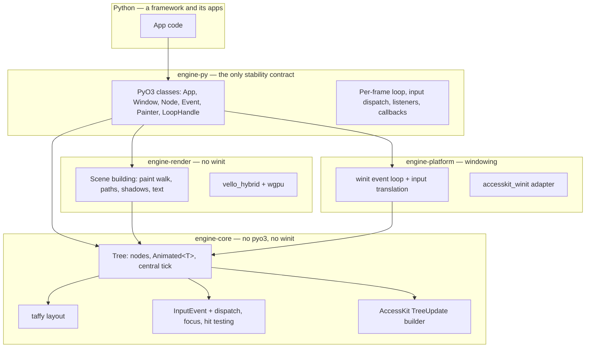
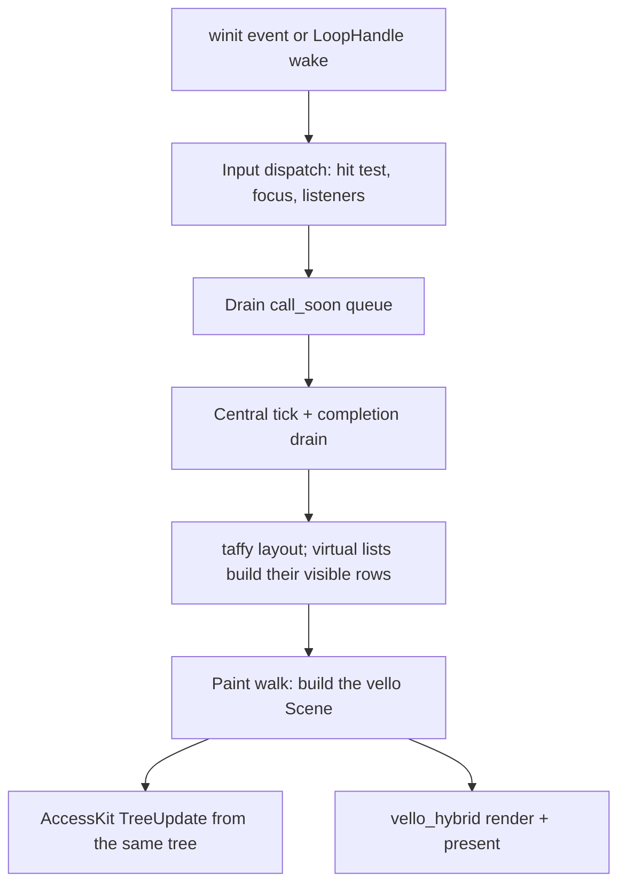

# tre Architecture

**A GPU-rendered retained-mode UI engine for Python, written in Rust — the building blocks of a desktop UI.**

Status: living design reference, rewritten at M102 (0.3.5) to describe the engine as it is after the M93–M101 program made `tre` a minimal building-block engine. Section numbers are stable: code comments cite them (`§5`, `§11.7`, ...), so a section that no longer applies keeps its number and says where its subject went. The design as it stood before 0.3.5 — Material Design 3 theming and components (§7), the declarative YAML layer (§16), the app shell — is in this file's git history at `v0.3.4`, and every step of the 0.3 line's build is in [`BUILD_TRACKER_ARCHIVE_0.3.md`](BUILD_TRACKER_ARCHIVE_0.3.md); the `0.4.0` line (partial redraw through a `vello_hybrid` fork) is tracked in [`BUILD_TRACKER.md`](BUILD_TRACKER.md). Update this document as decisions change; don't let it drift from the code.

---

## 1. Vision & Scope

- Application authors write **Python**. They never touch Rust, WGPU, or Vello.
- `tre` is an **engine, not a framework**. It provides building blocks — nodes, layout, paint, animation, input and events, text, accessibility, layers, threading, and docking — and nothing built *from* them. Widgets, design systems, theming, declarative views, data binding, and file loading belong to a framework on top; Tesserae is the first.
- The PyO3 boundary (`engine-py`) is the one stability contract.
- **Out of scope:** mobile, web, and bindings for any language but Python.
- **Not built on Masonry.** It uses the same libraries Masonry does (`vello_hybrid`, `taffy`, `parley`, `accesskit`) under a purpose-built retained tree with one central animation system — see [ADR-001](#adr-001-hand-rolled-vs-masonry).

### Locked Decisions

Resolved architectural questions, in one place. Add a row when a question is settled.

| Decision | Choice | Why |
|---|---|---|
| Scope | Desktop only (Windows/macOS/Linux); Python the only binding language | Every hour of binding work goes to the binding that ships |
| Engine or framework | An engine of building blocks; no widgets, theme, declarative layer, or file loading (M93–M101) | One framework (Tesserae) owns the design language and authoring model; two layers each doing half of it made both harder to change |
| One ingestion path per concern | Data in, not files: pixels as RGBA8, fonts as bytes, tree content through `create`/`set` | The framework owns every format and loading decision; `tre` cares only that data has the shape it expects |
| Python packaging | Per-version wheels, no `abi3` | Full PyO3 API access, at the cost of a larger OS × Python CI matrix |
| GPU backend | Pinned per OS: Vulkan on Linux, DX12 on Windows, Metal on macOS | The backend CI exercises is the one every user gets |
| Linux display protocol | Wayland and X11, Wayland primary | Broadest real-world compatibility |
| System tray / native menus | Not included | Both need GTK on Linux; `tre` carries no GTK dependency |
| App entry point | One blocking `App.run()` | Design Principle 1; matches every major desktop toolkit |
| Node data model | Common `PaintProperties` + a small per-`NodeKind` payload (§5) | One animation mechanism without one ever-growing struct |
| `NodeKind` | Closed enum of primitives: box, text, text input, image, path, canvas, scroll view, virtual list, terminal | Every widget is a composition of these; a new widget never needs a new kind |
| `NodeId` identity | Generational slotmap key | A stale handle fails a checked lookup instead of addressing the wrong node |
| Node lifetime | Attached nodes live while attached; detached ones while a handle points into them; `destroy()` frees now (M96, issue #10) | A forgotten `destroy()` never leaks, and a removed screen can be reattached intact |
| Layout dirty-scoping | Taffy's own incremental cache; no hand-rolled dirty flags for layout | Paint state shares no fields with `taffy::Style`, so paint-only changes can't dirty layout |
| Redraw | A per-tree dirty flag; the loop sleeps in `ControlFlow::Wait` when nothing animates or changed (M29) | No idle CPU or GPU use |
| Frame budget | 16.6 ms (60 Hz) target, 8.3 ms stretch, enforced by `frame_budget.rs` | A stated-but-unmeasured budget becomes fiction |
| Animation completion | Queue-drain: `tick()` pushes finished `CompletionHandle`s; `engine-py` drains them after the tick (§5) | `tick()` stays reentrancy-free |
| `animate()` dispatch | One string-keyed method, not per-property methods (§8) | Keeps the FFI surface independent of how many properties exist |
| Properties | `node.set(**props)` atomic — validate everything, then apply; `node.get(name)` reads anything `set` takes | One consistent way to change and read a node |
| Events | Named listeners (`on`/`off`), bubbling with `stop()`, raw input before what it caused (M94) | The DOM model framework authors already know |
| Focus indicator | `tre` draws none; `focus` carries `focus_visible` (the `:focus-visible` rule) | Focus styling is design, which is the framework's |
| Overlays | One layer mechanism for menus, dialogs, tooltips, sheets (§11.3) | Every overlay needs the same stacking, placement, input, and focus rules |
| Callback storage | Every Python callback lives in `engine-py` (`HandlerMap`, completions), never in `Tree`; `Window` implements `__traverse__`/`__clear__` | `engine-core` has no `pyo3`; one type per window carries the GC obligation |
| Threading | `Rc<RefCell<Tree>>` behind `ThreadBound` (M96); `LoopHandle.call_soon` the one cross-thread entry (M87) | Single-threaded by construction; a background thread hands work in rather than sharing state |
| Callback exceptions | Caught, logged, non-fatal | A broken handler never takes down a shipped app |
| AccessKit tree | Built in `engine-core` from the node tree every frame (§10) | It can't drift from what's on screen |
| Multiple windows | One `Tree` per OS window (§11.1) | No change to the node model; cross-window node moves are an accepted gap |
| Docking | Fixed five zones; `tre` docks, drags, and reports; the framework draws handles and highlights (§11.4) | The mechanism is hard to get right; the look is design |
| Virtualization | `virtual_list` kind that builds its own visible rows from `materialize(index)` (§11.7) | 100k real nodes would blow the frame budget |
| Versioning | Stay on 0.3.x until the `vello_hybrid` fork; 0.4.0 is reserved for it | The user's policy |

---

## 2. Design Principles

1. **Rust owns every frame; Python owns intent.** Python never runs during layout, paint, or interpolation. It changes state and registers callbacks; Rust computes and renders. `App.run()` hands the thread to `winit`'s loop until the last window closes; after that, Python runs only inside callbacks.
2. **One animation mechanism.** Every animatable value anywhere in the tree is the same `Animated<T>`, ticked by one central pass — no per-widget animation code.
3. **The PyO3 boundary is the only stability contract.** `engine-core`, `engine-render`, and `engine-platform` change freely; `engine-py`'s Python surface is what's versioned and documented.
4. **No dependency leaks across the boundary.** Vello, kurbo, peniko, taffy, and accesskit types never appear in Python signatures. Python sees ints, floats, strings, tuples, and `tre`'s own classes.
5. **Mechanism in the engine, meaning and look in the framework.** `tre` detects what it can know on its own — where the pointer is, what has focus, whether focus came from the keyboard — and reports it. What a node means (a checked checkbox) and how anything looks (a hover tint, a focus ring, a ripple) are set by the framework through ordinary properties and animations.
6. **De-risk unknowns before building on them.** A new rendering capability gets a pixel test against the pinned `vello_hybrid` before anything depends on it.

---

## 3. Technology Stack

| Layer | Crate | Role |
|---|---|---|
| Windowing, input, IME | `winit` | Event loop (owns the main thread), windows, keyboard and pointer input |
| GPU | `wgpu` | Device and surface management |
| 2D rendering | `vello_hybrid` (`wgpu` features only) | CPU preprocess, GPU raster of paths, images, and blurred shadows |
| Geometry, color | `kurbo`, `peniko` | `BezPath`, `Affine`, `Color` — Vello's vocabulary |
| Text | `parley` (with `glifo` for glyph drawing) | Shaping, line breaking, BiDi, font fallback |
| Layout | `taffy` | Flexbox; text leaf sizes come from Parley |
| Accessibility | `accesskit`, `accesskit_winit` | The platform accessibility tree (UIA, NSAccessibility, AT-SPI) |
| Clipboard | `arboard` (text only) | No GTK dependency on Linux |
| Terminal | `portable-pty`, `vt100` | Spawn a shell on a pseudo-terminal; parse its VT/ANSI stream into a cell grid |
| Python bindings | `pyo3` | The FFI |
| Packaging | `maturin` | Builds the wheel |
| Errors, logging | `thiserror`, `tracing` | Typed errors at the boundary; structured logs controlled by `RUST_LOG` |

`vello_hybrid`, `parley`, `kurbo`, and `peniko` are one co-evolving Linebender family: pin and bump them as a set.

---

## 4. System Architecture

Every edge means **compile-time "depends on."**


```mermaid
graph TD
    subgraph Python["Python — a framework and its apps"]
        A[App code]
    end
    subgraph FFI["engine-py — the only stability contract"]
        C[PyO3 classes: App, Window, Node, Event, Painter, LoopHandle]
        R[Per-frame loop, input dispatch, listeners, callbacks]
    end
    subgraph Core["engine-core — no pyo3, no winit"]
        D[Tree: nodes, Animated&lt;T&gt;, central tick]
        E[taffy layout]
        N[InputEvent + dispatch, focus, hit testing]
        O[AccessKit TreeUpdate builder]
    end
    subgraph Render["engine-render — no winit"]
        H[Scene building: paint walk, paths, shadows, text]
        I[vello_hybrid + wgpu]
    end
    subgraph Platform["engine-platform — windowing"]
        K[winit event loop + input translation]
        L[accesskit_winit adapter]
    end
    A --> C
    C --> D
    C --> H
    C --> K
    H --> D
    K --> D
    D --> E
    D --> N
    D --> O
```

**Crate boundary rule.** `engine-core` knows nothing of Python, `winit`, or the GPU; it's tested in isolation. It depends on the plain `accesskit` data crate, which is small and OS-agnostic like `taffy`, so the accessibility tree is built next to the node tree it describes. `engine-render` walks `engine-core`'s tree to build a scene and never opens a window itself. `engine-platform` owns the `winit` loop, opens the windows, runs the AccessKit adapter, and translates `winit` input into `engine-core`'s `InputEvent`. `engine-py` is the only crate that imports `pyo3`; it also names `winit`'s `Window` type, to build a GPU surface on each window `engine-platform` hands it and to set its title.

**Runtime dispatch is inverted.** `engine_platform::run_windowed_multi` is generic over a set of closures — `on_window_created`, `on_frame`, `on_input`, `on_access_action`, `on_lifecycle`, and `build_access_update` — and calls them as the loop runs, never touching a `Tree` itself. `engine-py`'s `App.run()` supplies them; only it can reach Python. So the compile-time graph reads `engine-py → engine-platform` while input flows `engine-platform → engine-py's closures`.

---

## 5. Core Data Model

```rust
pub struct Node {
    pub id: NodeId,                    // generational slotmap key
    pub parent: Option<NodeId>,
    pub children: Vec<NodeId>,
    pub visible: bool,                 // false: no paint, layout, hits, focus, or a11y node
    pub z_index: i32,                  // paint and hit order among siblings
    pub kind: NodeKind,
    pub layout_style: taffy::Style,
    pub paint: PaintProperties,
    pub access: AccessNodeData,        // role, label, value, states (§10)
    // ...
}

pub struct PaintProperties {
    pub background: Animated<Color>,   // `fill` in Python
    pub corner_radius: Animated<f64>,
    pub corner_radii_override: Option<Animated<CornerRadii>>,
    pub opacity: Animated<f64>,        // group opacity: the subtree fades as one layer
    pub border_color: Animated<Color>, // `stroke_color`
    pub border_width: Animated<f64>,   // `stroke_width`, drawn inside the box
    pub shadows: Animated<Shadows>,    // CSS box-shadow model
    pub node_transform: NodeTransform, // translate_x/y, scale, rotation_deg, each Animated
    pub transform: Animated<Affine>,   // a general affine, composed down the tree (§11.9)
}

pub enum NodeKind {
    Rect,                              // "box"
    Container,                         // the window root
    Text(TextState),
    TextField(TextFieldState),         // "text_input"
    Image(ImageState),
    Path(PathState),                   // SVG data, view box, trim, morph
    Canvas(CanvasState),
    ScrollView(ScrollViewState),
    VirtualList(VirtualListState),
    Terminal(TerminalState),
}
```

Rust field names predate the 0.3.5 property names; `engine-py` maps `fill` → `background`, `stroke_*` → `border_*`.

**`Animated<T>`** holds a `current` value and an optional `ActiveAnimation { from, to, start, duration, curve, on_complete }`. `T` implements `Interpolate`: numbers and colors interpolate linearly (colors per sRGB component), shadow lists pad the shorter list with transparent shadows, corner radii per corner, and path data by resampling both paths by length and aligning closed contours at the best starting point — so any two closed shapes morph cleanly. `MotionCurve` is `Linear` or a cubic `Bezier`.

**Central tick.** One pass per frame advances every active animation. Animating from `current` means retargeting mid-flight never jumps.

**Completion delivery is a queue.** When an animation finishes, `tick()` only pushes its `CompletionHandle` onto a per-tree `Vec`. `engine-py` drains it after the tick and calls the matching Python callbacks — so nothing a callback does, including starting another animation, runs while the tick is iterating. An animation replaced or stopped before it finishes drops its handle, and its callback never runs.

---

## 6. Per-Frame Pipeline


```mermaid
flowchart TD
    EV[winit event or LoopHandle wake] --> IN[Input dispatch: hit test, focus, listeners]
    IN --> Q[Drain call_soon queue]
    Q --> TICK[Central tick + completion drain]
    TICK --> LAYOUT[taffy layout; virtual lists build their visible rows]
    LAYOUT --> PAINT[Paint walk: build the vello Scene]
    PAINT --> A11Y[AccessKit TreeUpdate from the same tree]
    PAINT --> RENDER[vello_hybrid render + present]
```

- **Layout** runs through Taffy's own cache: paint-only changes never dirty it. Parley re-shapes a text only when its content, font, size, or width changes (a per-node shaping cache keyed on those inputs).
- **Paint** re-encodes the scene each frame, as Vello's own consumers do; the cost lever is skipping expensive inputs (layout, shaping) and culling off-screen subtrees (§11.8), not patching scenes.
- **Idle.** A tree's dirty flag records any change; when no window is dirty and nothing animates, the loop drops to `ControlFlow::Wait` and uses no CPU. `LoopHandle.call_soon` wakes it through an `EventLoopWaker`.
- **Headless time.** `Window.advance(ms)` runs the same tick, completion drain, and layout on a pinned per-window clock, so tests need no frames.
- **Frame budget.** 16.6 ms, with 8.3 ms as a stretch. `crates/engine-render/tests/frame_budget.rs` (run with `--release --ignored`) times tick, layout, scene build, and GPU submit for 300 animating nodes and fails past 16.6 ms; medians were 0.3–1.1 ms on the development machine at M101.

---

## 7. Material Design 3 — moved to the framework

Until 0.3.5 this section specified `engine-md3`: dynamic color, elevation levels, state layers and ripple, shape morphing, motion tokens, and the container transform. M99 removed all of it. What survives in the engine is design-neutral: layered `shadows` (an elevation level is a shadow list), path morphing (§5), cubic-bezier easing, group opacity, and `clip_children` (a ripple is a round box scaled up inside a clipping button). The MD3 reference data Tesserae ported — elevation shadows, motion curves, component behavior — is in `docs/design/`.

---

## 8. Python/Rust FFI Boundary (`engine-py`)

**Classes.** `App` (collects windows, `run()`, `thread_handle()`), `Window` (one tree and OS window: `create`, `root`, layers, window events, `simulate`, `advance`, clipboard, docking), `Node` (a handle: `set`/`get`/`animate`, `on`/`off`, tree structure, focus, pointer capture), `Event`, `Painter` (a canvas's draw surface), and `LoopHandle`. Each wraps its state in a `ThreadBound` (§9).

**Nodes and properties.** `Window.create(kind, **props)` makes a detached node and applies `props` through the same code as `Node.set`. `set` parses every value into a change list first and applies nothing unless all of them are valid, so a bad value never leaves a node half-updated. `get` reads anything `set` takes, plus `kind`, `focused`, `layer_placement`, and the `layout_*` values, which run pending layout first. `animate(name, to, duration_ms, easing, on_complete)` is one string-keyed method; an unknown or non-animatable name raises `ValueError`, a value of the wrong shape `ValueError` or `TypeError`.

**Callbacks live in `engine-py`, never in `Tree`.** `engine-core` has no `pyo3`, so it can't hold a `Py<PyAny>`. Each window owns:

```rust
// (node, what it's for) -> (callback, whether it takes the Event)
pub(crate) type HandlerMap = Rc<RefCell<HashMap<(NodeId, HandlerKey), (Py<PyAny>, bool)>>>;

pub(crate) enum HandlerKey {
    Listener(EventType), // node.on("click", ...)
    Draw,                // a canvas's draw
    Materialize,         // a virtual list's materialize
    SizeHint,            //   ...and size_hint
}
```

plus the animation-completion registry and the window's own listeners. `Window` implements `__traverse__`/`__clear__` over all three, so a callback that captures its own window or node is collectable. Freed nodes' entries are pruned when their subtree is destroyed. Whether a callback takes the `Event` is decided once, at registration, from its signature.

**Dispatch.** `engine-core`'s `Tree::dispatch` turns an `InputEvent` into outcomes (hover changes, focus moves, activation, text edits, scroll). `engine-py` then delivers the M94 event model: it resolves the target, builds an `Event`, and walks the target's ancestors calling listeners until one calls `stop()`. Live input and `Window.simulate` share this one path, so a test exercises exactly what a user does. Text-input shortcuts (Ctrl+C/X/V/A) and a focused terminal's key handling are part of it.

**Errors** funnel through `EngineError` (`thiserror`) with one `From<EngineError> for PyErr`, beside direct `ValueError`s for property validation. An exception inside a callback is caught and logged (§9).

**Removed names.** `python/tre/_removed.py` lists every name 0.3.5 removed or renamed. With `TRE_FORBID_REMOVED=1` it makes each raise an error naming its replacement; the module uses only 0.3.4 names, so a framework can run it against 0.3.4 to find its uses before upgrading.

---

## 9. Threading & Event Loop Model

- **`winit` owns the main thread** — a hard requirement on macOS, and the simplest correct choice elsewhere. Python runs only inside callbacks invoked from the loop.
- **State is `Rc<RefCell<Tree>>`, single-threaded by construction.** Every Python-held object wraps its state in `ThreadBound<T>` (M96, issue #10): *use* from another thread panics (`PanicException`, a `BaseException`); *drop* from another thread moves the state, untouched, into a queue its owning thread drains at the next frame or `tre` call. This lets Python's cyclic collector run on any thread without leaking or crashing, which `#[pyclass(unsendable)]` could not.
- **`LoopHandle` is the one cross-thread entry point** (M87, issue #6). `App.thread_handle()` returns a `Send + Sync` handle holding a shared queue and an `EventLoopWaker`; `call_soon(fn)` queues `fn` and wakes the loop, which runs queued callbacks in FIFO order at the top of the next frame. A worker does its I/O itself and hands the loop only the result.
- **Callback exceptions** are caught, logged with their traceback through `tracing`, and don't stop the loop — as in Tkinter, Qt, and GTK. A slow callback stalls the frame, as in every main-thread toolkit; slow work belongs on a worker (above).

---

## 10. Accessibility

`accesskit` + `accesskit_winit`, wired directly. `AccessNodeData` on each node is the source of truth, and `Tree::build_access_update()` builds a fresh `TreeUpdate` from the node tree every frame, so it can't drift from what's painted. Invisible nodes are left out.

- **What a node says is what the framework sets**: `role`, `label`, `value` (text or number) with `value_min`/`value_max`/`value_step`, `checked`, `selected`, `expanded`, `disabled`, `level`, `live`, `a11y_hidden`. A text input's value is its text; text inputs and terminals are `textbox` from creation. `tre` infers nothing else — it can't know what a box means.
- **Actions follow from role and state**: focusable nodes offer Focus; button-like roles offer Click; a slider or value range offers Increment/Decrement/SetValue; `expanded` offers Expand/Collapse.
- **Requests route through input dispatch**, not a side channel: Click arrives as `click`, Focus as a focus move (with `focus_visible=True`), and the rest as the `a11y_action` event.
- **Keyboard focus** is `Tree`'s: `focusable` and `tab_index` define the order, Tab and Shift+Tab move through it (scoped to the layer holding focus, §11.3), and Enter or Space on a focused node that isn't a text input or terminal fire `click`. Component-specific keys (arrows in a slider) are the framework's, through `key_down`.

`accesskit` has made breaking changes between versions; pin it exactly and check the pinned source when upgrading.

---

## 11. Desktop Shell & Workspace

### 11.1 Multiple windows

One `Tree` per OS window. `winit` tags each event with its `WindowId`, so routing it to the right tree is a lookup. A `NodeId` means something only in the tree that issued it: moving a node to another window is an accepted gap — rebuild it there.

### 11.2 App shell

Moved to the framework (M99). A shell is an ordinary tree: regions are boxes, navigation is `old.remove()` then `root.add_child(new)`, and a removed screen keeps its state for reattaching.

### 11.3 Layers — one overlay mechanism

Menus, dropdowns, context menus, tooltips, dialogs, snackbars, and sheets are one primitive. `Window.show_layer(node, anchor, placement, modal, dismissible)` attaches `node` as a layer above the content, in the order shown, with an `OverlayMeta` beside it in `Tree`:

- **Placement** is recomputed at every layout: against the anchor's computed box on the requested side, flipped when the opposite side has more room, then shifted inside the window.
- **Input**: hit testing reaches layers before content. A modal layer blocks input beneath it and takes focus. A press outside a dismissible layer (and its anchor) is consumed and reported as `dismiss`; so is Escape, to the topmost dismissible layer. Events bubble to a layer's node and stop there.
- **Focus**: each layer is its own Tab scope; `hide_layer` returns focus to where it was when the layer opened.

Layers are ordinary nodes, so paint, hit testing, focus, and the accessibility tree walk them with no special cases. Closing is the framework's decision: `dismiss` asks, `hide_layer` closes.

### 11.4 Docking

Five fixed zones — left, right, top, bottom, center — each a node the framework builds and registers (`add_dock_zone`). A zone holds panels and shows one (`dock_panel`, `set_active_panel`). `start_panel_drag(panel)` begins a drag in the ordinary input pipeline; the `dock_target` window event reports the zone under the pointer as it changes, and releasing the primary button moves the panel and reports `dock_drop`. The handle, the drop highlight, and tabs are the framework's (M99, D10). No arbitrary nested splits.

### 11.5 Splitters

Moved to the framework (M99): a divider is a box that captures the pointer and sets its neighbors' `flex_basis`.

### 11.6 Toolbars & status bars

Ordinary boxes; nothing engine-specific.

### 11.7 Virtualization

`NodeKind::VirtualList` keeps `item_count` logical rows and a small map of materialized ones. Whenever layout runs, it computes the visible range from its scroll offset and extents (`item_extent`, or `size_hint(index)` per row, resolved lazily into prefix offsets), calls `materialize(index)` for rows newly in view, attaches each with the list's width and its row height, and detaches rows scrolled away — freed unless the framework keeps a handle to reuse. The content size is the sum of extents, so the scroll range is right without every row existing. A raising callback is logged and leaves its row empty.

### 11.8 Culling

The paint walk skips any subtree whose transformed bounds miss the visible clip. Virtualization avoids *creating* off-screen rows; culling skips *painting* whatever is off-screen for any other reason.

### 11.9 Transform composition

A node's effective transform is its parent's composed with its own — the general `transform` affine and the per-part `node_transform` (translate, then rotate and scale about the node's center). Pan and zoom of a whole canvas is a transform on its container.

### 11.10 Hit testing

The pointer is resolved in reverse paint order (layers first), mapping the point into each candidate's local space through the inverse of its composed transform and testing it against the computed box — or, for a canvas, against the shape its painter set (`set_hit_test_circle`, `set_hit_test_path` within a tolerance of true curve geometry). Text nodes and nodes with `hit_testable=False` are skipped, so a press on a label lands on its button.

### 11.11 Node graphs & charts

No special mechanism: canvases (or path nodes) for drawing, transforms for pan and zoom, precise canvas hit tests for picking, and virtualization and culling for size.

---

## 12. Project Structure

```
tre/
├── Cargo.toml                 # workspace
├── crates/
│   ├── engine-core/           # Tree, Animated<T>, layout, dispatch, focus, layers, docking model, AccessKit builder
│   ├── engine-render/         # scene building, text shaping, paths, shadows, font registry; pixel tests in tests/
│   ├── engine-platform/       # winit loop, input translation, accesskit_winit, EventLoopWaker
│   └── engine-py/             # PyO3 classes, per-frame loop, listeners, terminal sessions
├── python/tre/                # __init__.py, _core.pyi (type stubs), _removed.py, py.typed
├── tests/                     # pytest suite (headless, through simulate and advance)
├── examples/                  # one runnable script per building block, plus the showcase
├── docs/                      # MkDocs site
├── tools/                     # build-tracker artifact generator
└── archive/                   # the first TRE engine and its lessons learned
```

---

## 13. Environment Setup

| Tool | Notes |
|---|---|
| Rust (`rustup`, stable) | Check the Linebender crates' MSRV when bumping them |
| Python 3.9+ | With `maturin` |
| Linux | `libxkbcommon`, Wayland or X11 headers, a Vulkan driver |
| macOS | Xcode command-line tools |
| Windows | MSVC build tools |

```bash
python -m venv .venv && source .venv/bin/activate
pip install maturin
maturin develop --release -m crates/engine-py/Cargo.toml
python examples/switch.py
```

| Command | Use |
|---|---|
| `cargo test --workspace --release` | Every Rust test, including GPU pixel tests (they exit cleanly without a GPU) |
| `cargo clippy --workspace --all-targets --release -- -D warnings` | Lints |
| `pytest tests/` | The Python suite, headless |
| `mkdocs build --strict` | The docs, with link and anchor checks |
| `mypy --strict python/tre` | The type stubs |

**Packaging.** `.github/workflows/wheels.yml` builds manylinux-repaired Linux wheels inside the manylinux container, plus macOS and Windows wheels, across supported Python versions, on a `v*` tag, and attaches them and an sdist to the GitHub Release. A repaired wheel vendors system libraries — TRE's own duplicate-`xkbcommon` segfault came from that — so the built artifact is tested end to end, not just `maturin develop`.

---

## 14. Build Order

Historical. The original fifteen-step de-risking order (a static rect through `vello_hybrid`, then animation, layout, text, Python, accessibility, shadows, ...) was followed through M1–M27; see [`BUILD_TRACKER_ARCHIVE_M1-M50.md`](BUILD_TRACKER_ARCHIVE_M1-M50.md). Later work is planned milestone by milestone in [`BUILD_TRACKER_ARCHIVE_0.3.md`](BUILD_TRACKER_ARCHIVE_0.3.md) (the 0.3 line) and [`BUILD_TRACKER.md`](BUILD_TRACKER.md) (`0.4.0`).

---

## 15. Risk Register

| Risk | Detail | Mitigation |
|---|---|---|
| Vello churn | `vello_hybrid` is pre-1.0 and its architecture has been rewritten between releases | Pin exact versions; confine Vello calls to `engine-render`; pixel tests for every capability |
| Partial redraw | `vello_hybrid` offers no scissored or no-clear render, so every frame repaints fully | Idle loop sleeps (§6); the fork that adds it is issue #4, the `0.4.0` line (`BUILD_TRACKER.md`, M1–M6) |
| `accesskit` churn | Breaking changes between minor versions | Pin exactly; verify against the pinned source |
| Wheel packaging | A repaired wheel vendors system libraries | Test the built wheel end to end (§13) |
| Terminal portability | `portable-pty`'s Windows backend isn't exercised | The terminal kind is POSIX-verified; Windows is untested |
| Framework drift | Tesserae depends on `tre`'s API and behavior | `_removed.py` and the migration page for every breaking release; Tesserae's CI pins `tre` |

---

## 16. Declarative Authoring — moved to the framework

Until 0.3.5 this section specified the `engine-spec` crate: YAML views, a stylesheet cascade, `{{ }}` binding expressions, reconciliation and hot reload, composition by `include:`, and the `Signal`/`ViewModel` reactivity in `engine-py`. M98 removed all of it. What a declarative layer needs from the engine is here: `create` and atomic `set` to build and patch nodes, `insert_child` to reorder keyed children while keeping their identity, focus, and animations, `remove` that keeps a subtree for reattaching, and `LoopHandle.call_soon` for a file watcher to trigger a rebuild inside `App.run()`.

---

## ADR-001: Hand-rolled vs. Masonry

**Decision:** hand-roll the tree and animation substrate on `vello_hybrid` + `taffy` + `parley` + `accesskit`; don't depend on Masonry.

**Why:** Masonry's value is centralizing focus, pointer, lifecycle, and accessibility plumbing across independently written Rust widget types. `tre` exposes no Rust widget types at all — its widgets are built in Python from a handful of primitive kinds — and what it needs most, one centrally ticked animation system driven from Python, doesn't fit Masonry's per-widget trait model. `tre` did end up building the plumbing Masonry centralizes (focus, pointer dispatch, GC-safe callbacks, the AccessKit builder), but each piece is shaped by that animation model and by the Python boundary; building it on Masonry would have meant fighting its model rather than avoiding the work.

**Revisit trigger:** Masonry shipping a centrally ticked animation system that works with arbitrary per-node state, or its primitives becoming usable without its widget model.
