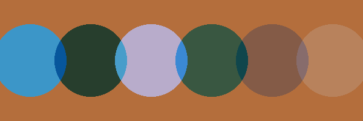

# Demo: Phase 10 Step 10.2.3 -- Non-Normal Blend Modes

```bash
./demo/phase10_step10_2_3/run_blend_mode_demo.sh
```

**What this closes.** The third of six gaps `PLAN.md` scheduled after
Step 10.2's own follow-ups: `BlendMode`'s five non-`Normal` variants
(`Multiply`/`Screen`/`Overlay`/`SoftLight`/`ColorDodge`) -- a real enum
variant since Step 10.2 -- had no rendering support at all.

**A plan-invalidating finding, and the real pivot.** `PLAN.md`'s original
primary path was `VK_EXT_blend_operation_advanced` (mapping each blend
mode directly onto a hardware `VkBlendOp`). Direct `vulkaninfo`
inspection of this project's own real dev GPU (AMD Radeon 890M, Mesa
26.2.2-arch3.2, RADV driver) showed the extension is simply not in the
device's advertised extension list -- independently corroborated via
Mesa's own release notes, ruling out a one-off local misconfiguration.
That path could never be exercised by a real GPU demo on this project's
own hardware, a direct conflict with this project's standing "real code,
real GPU demos as the correctness oracle" discipline. Presented to the
user as a genuine three-way fork (build the real alternative, ship only
a fallback, or build both); the user chose the real alternative:
`VK_KHR_dynamic_rendering_local_read` -- confirmed present on this same
real GPU via `vulkaninfo`.

**What's real now.** `Polygon`/`Path` solid fill under a non-`Normal`
`BlendMode` reads the destination pixel a PRECEDING draw in the same
frame already wrote, via a real `VK_DESCRIPTOR_TYPE_INPUT_ATTACHMENT`
descriptor and GLSL `subpassLoad` (`flat_color_blend.frag`), computes the
requested W3C blend formula itself, and writes the fully-composited
result directly -- hardware blending is disabled for this pipeline
(`blend_enable(false)`), unlike every other pipeline in this codebase.

- A device-level capability query (`RhiDevice::local_read_blend_
  supported`, mirroring `debug_validation_available`'s own pattern)
  gates everything: unsupported hardware falls back to plain `FlatColor`
  (`Normal` blending) -- a real, disclosed degradation, never a silent
  attempt to use resources that were never created.
- A SEPARATE descriptor set (set 1, one `INPUT_ATTACHMENT` binding) and
  pipeline layout exist only for `PipelineKind::FlatColorBlend` --
  extending the existing bindless set 0 would have required renumbering
  every other shader's bindings (`VARIABLE_DESCRIPTOR_COUNT` must stay
  the highest-numbered binding in a layout).
- The swapchain/headless color attachment lives in
  `VK_IMAGE_LAYOUT_RENDERING_LOCAL_READ_KHR` for the whole frame when
  supported -- a layout usable as a color attachment AND an input
  attachment simultaneously, so no extra transitions are needed between
  ordinary and blend-mode draws. A real, disclosed per-swapchain
  capability check (`RhiSwapchain::supports_local_read_input_attachment`)
  additionally guards a windowed swapchain, whose presentable surface
  isn't spec-guaranteed to support `INPUT_ATTACHMENT` usage the way a
  manually allocated headless image always safely can.
- A real by-region barrier (`COLOR_ATTACHMENT_WRITE` -> `INPUT_
  ATTACHMENT_READ`) is inserted before EVERY `FlatColorBlend` draw, not
  once per frame -- using this codebase's own already-established
  classic (non-`_2`) `vkCmdPipelineBarrier` API, since `INPUT_ATTACHMENT_
  READ`/`BY_REGION` are both core (non-sync2) values.

**Scope decisions, disclosed not accidental.** `Polygon`/`Path` solid
fill only (not `Rectangle`/`Circle`, not gradient/texture fill) -- one
shared pipeline with a runtime blend-mode branch (a repurposed push
constant, the same precedent `texture_index`/`gradient_word_index`
already established), not one pipeline per mode. Opaque source AND
destination only (both alphas assumed 1) -- the general W3C alpha-
weighted compositing formula collapses to `Co = B(Cb, Cs)` directly at
full opacity, so a shape drawn under an active `Canvas` opacity does not
get that opacity correctly applied to a blend-mode fill in this pass.
Only correct against the swapchain/headless attachment `begin_frame`
sets up -- not while a `PushLayer` render-to-texture target is active.

**What this demo proves, not just "didn't crash."** A background
rectangle (`FillStyle::Solid`, ordinary `Normal` blending) is drawn
first, then six polygon swatches on top of it, one per `BlendMode`
(`Normal` plus the five real formulas). Every swatch's own center pixel
is compared against an independent Rust reference implementation of the
exact same W3C blend formula, computed in linear space and re-encoded to
sRGB -- on this real GPU, every channel of every swatch matched the
independent reference exactly or within 1 of 255 levels. The `Normal`
swatch proves `shapes.rs`'s dispatch still routes a `Normal` blend mode
through the ordinary `FlatColor` pipeline (an exact opaque overwrite, no
blend math at all) even on hardware that supports the new capability.


