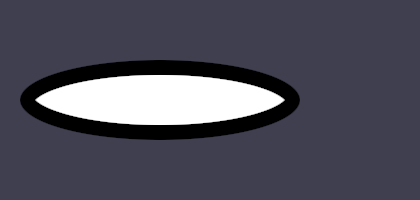

# Demo: Phase 10 Step 10.2.4 -- SDF Fidelity: Exact Ellipse Distance Field

```bash
./demo/phase10_step10_2_4/run_ellipse_sdf_fidelity_demo.sh
```

**What this closes.** The fourth of six gaps `PLAN.md` scheduled after
Step 10.2's own follow-ups: `sdf_ellipse.frag`'s disclosed "scaled
circle" ellipse SDF approximation (exact only when `radius.x ==
radius.y`) had never been checked against a verified-correct reference.

**What's real now.** `sd_ellipse` is Inigo Quilez's own published,
real, near-machine-precision ellipse distance field
(iquilezles.org/articles/ellipsedist) -- a Newton-Raphson refinement on
the ellipse's implicit parametrization (there is no simpler true closed
form; the exact point-to-ellipse distance is the root of a quartic in
general, and IQ's own article notes the direct quartic solve is "both
expensive and not very stable"). 5 iterations (IQ's own published
default) converge to sub-0.001px accuracy at this engine's own UI-scale
eccentricities.

**A real, measured finding, not an assumption.** The old approximation's
fill/no-fill BOUNDARY was, perhaps surprisingly, always exactly correct
-- `k1 = length(p/r)` is exactly `1.0` everywhere ON the true ellipse
boundary by construction, so the old formula's zero-crossing always
landed in the right place. Its real error was in the SDF's actual
MAGNITUDE away from the boundary, which is exactly what
`border_thickness` rendering depends on (`inner_d = d + border_thickness`)
-- a bordered, eccentric ellipse's border thickness would have visibly
varied around its own perimeter under the old formula. `tre-engine`'s
own `sdf_ellipse_fidelity` unit tests measured the old approximation's
real error against an independent brute-force (dense parametric
boundary sampling) ground truth: essentially zero at the new formula,
10.67px and 1.31px at two representative off-axis points under the old
one, at a 3.5:1 eccentricity.

**Corner smoothing's own disclosed gap, also resolved by research (no
code change).** Figma's own published squircle
(figma.com/blog/desperately-seeking-squircles) turned out to be a real
SVG path per corner (two curvature-continuous cubic Beziers plus a
circular arc), not an implicit distance field -- there is no simple
closed form of it to swap into `sdf_rect_styled.frag`'s own
`corner_norm` superellipse blend, and an exact per-pixel distance to an
arbitrary Bezier curve is real, substantially harder, out-of-scope work.
Kept as-is, with its real deviation now measured instead of left
unverified: identical to Figma's construction at `smoothing == 0`,
diverging up to ~71% of the corner radius at `smoothing == 1.0` -- a
real, visually significant difference, not a rounding-scale one
(`corner_smoothing_fidelity` tests have the full derivation).

**What this demo proves, not just "didn't crash."** No prior demo ever
drew a genuinely non-circular ellipse (every `radius` used elsewhere has
`radius.x == radius.y`, the one case the old approximation already got
right) -- this is the first real GPU render of one. A real, eccentric,
bordered ellipse (radius 140x40, border 15px) is drawn, and the real
border/fill transition pixel is found by bisecting on actual GPU-rendered
color at four angles (0°, 30°, 55°, 80°); every one lands exactly where
a second, independent CPU transcription of the exact formula (sharing no
code with either the shader or `tre-engine`'s own unit tests) predicts.
Every pre-existing GPU demo re-run and confirmed passing, including the
three real consumers of the ellipse pipeline (`shape_full_rendering_demo`,
`gradient_fill_demo`, `texture_fill_demo`) at their own circular
(`radius.x == radius.y`) cases, where old and new are both exact.


