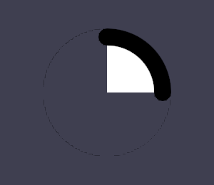

# Demo: Phase 10 Step 10.2.5 -- Rounded Stroke Caps on Partial-Arc Circles

```bash
./demo/phase10_step10_2_5/run_arc_rounded_cap_demo.sh
```

**What this closes.** The fifth of six gaps `PLAN.md` scheduled after
Step 10.2's own follow-ups: `sdf_ellipse.frag`'s hard-edged angular
sector cutoff for a partial-arc `Circle`/`Ellipse` gave every such
shape flat, unrounded cut edges, even with a real `border_thickness`
set -- a progress-ring-style component's two ends never rounded off the
way `stroke_line_cap` (already a real field) implies they should.

**What's real now.** A new `cap_sdf` function computes the signed
distance to a real circle of radius `border_thickness / 2`, centered on
the border band's own centerline at each of the arc's two cut angles --
the standard 2D "rounded line/capsule end" SDF technique, applied to an
arc's cut angle instead of a straight segment's end. The final signed
distance is `min(sector_clipped_d, cap_start_d, cap_end_d)`: a plain
SDF union that only ever pulls the distance MORE "inside" near the two
cut points, rounding the border's own stroke ends there without
touching the SDF anywhere else -- the plain swept interior, or the rest
of the excluded wedge, are both unaffected. Applies only when
`border_thickness > 0.0` (a borderless partial arc has no stroke to
round the end of, and keeps its existing flat cutoff) and
`arc_sweep_angle < TAU` (a full ellipse needs no cap geometry at all).

**A disclosed approximation, narrowed from a broader one.** The cap
center is placed along the RADIAL direction at each cut angle (exact
for a `Circle`, since radial and normal directions coincide there) --
for a true, non-uniform-radius `Ellipse`, this is a real, consistent
approximation, since the local outward normal generally differs from
the radial direction (the same distinction Step 10.2.4's own research
into the exact ellipse SDF surfaced). This is the one remaining
disclosed approximation in the ellipse pipeline, now that Step 10.2.4
made the core fill/border distance field itself exact.

**What this demo proves, not just "didn't crash."** A bordered quarter
circle (12 o'clock to 3 o'clock, a real 24px border) is drawn, and real
pixels are sampled a few degrees past each of the two cut angles, at
the border band's own centerline radius: 4° past each cut (still within
the cap's own ~24° angular footprint at this radius) is confirmed
border-colored -- proving the round cap, not a removed cutoff -- while
25° past each cut is confirmed still-excluded background, proving the
rounding is real and BOUNDED, not simply "the cutoff stopped working."
Every pre-existing GPU demo re-run and confirmed passing, including
`shape_full_rendering_demo`'s own pre-existing 270°-sweep bordered
circle, which now visibly shows the same real rounded caps.


